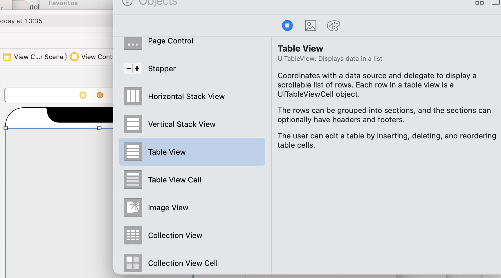

`Desarrollo Mobile` > `Swift Intermedio`

## Cómo agregar un TableView a nuestro ViewController

### OBJETIVO

- Usar las distintas maneras de agregar un TableViewController a una vista en Swift.

#### REQUISITOS

1. Xcode.

#### DESARROLLO

1.- Ir a Storyboard, en el VC por defecto agregar un TableViewController desde el Library y ajustar los constraints.

2.- Conectar dicho VC a su clase de Swift.

3.- Ejecutar la app.

4.- Crear un TVC desde el componente por defecto, sin agregar el View a un VC.

5.- Declarar un TVC mediante código y mostrarlo en pantalla.
