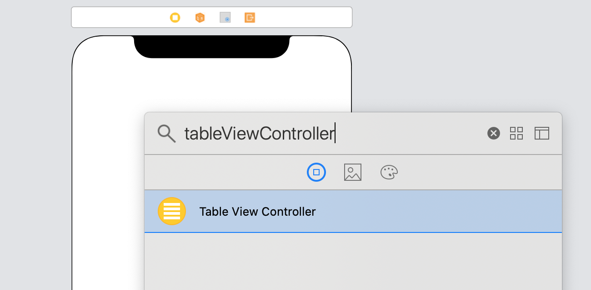

`Desarrollo Mobile` > `Swift Intermedio`

## Cómo agregar un TableView a nuestro ViewController

### OBJETIVO

- Usar las distintas maneras de agregar un TableViewController a una App en Swift.

#### REQUISITOS

1. Xcode.

#### DESARROLLO

##### Usando un TableView

1. Ir a Storyboard, en el VC por defecto agregar un TableView desde el Library.

   

2. Ajustar la posición.

3. Ejecuta el app en el simulador de tu preferencia y observa que ocurre al cambiar la orientación.

##### Usando un TableView Controller

1. Ir a Storyboard, en algún área disponible agregar un TableViewController desde el Library.

   

2. En el panel de Inspección, en la pestaña Attributes, asigna este Controller como el inicial.

3. Ejecuta el app en el simulador de tu preferencia y observa que ocurre al cambiar la orientación.

##### Crear un TableView, sin agregar el View a un ViewController

1. Declarar el siguiente código en el ViewController por defecto:

   **override** **func** viewDidLoad() {

     **super**.viewDidLoad()

      

     **let** tv = UITableView()

     tv.frame = CGRect(x: 0, y: 0, width: 320, height: 480)

     **self**.view.addSubview(tv)

      

    }

2. Ejecuta el app en el simulador de tu preferencia y observa que ocurre al cambiar la orientación.
