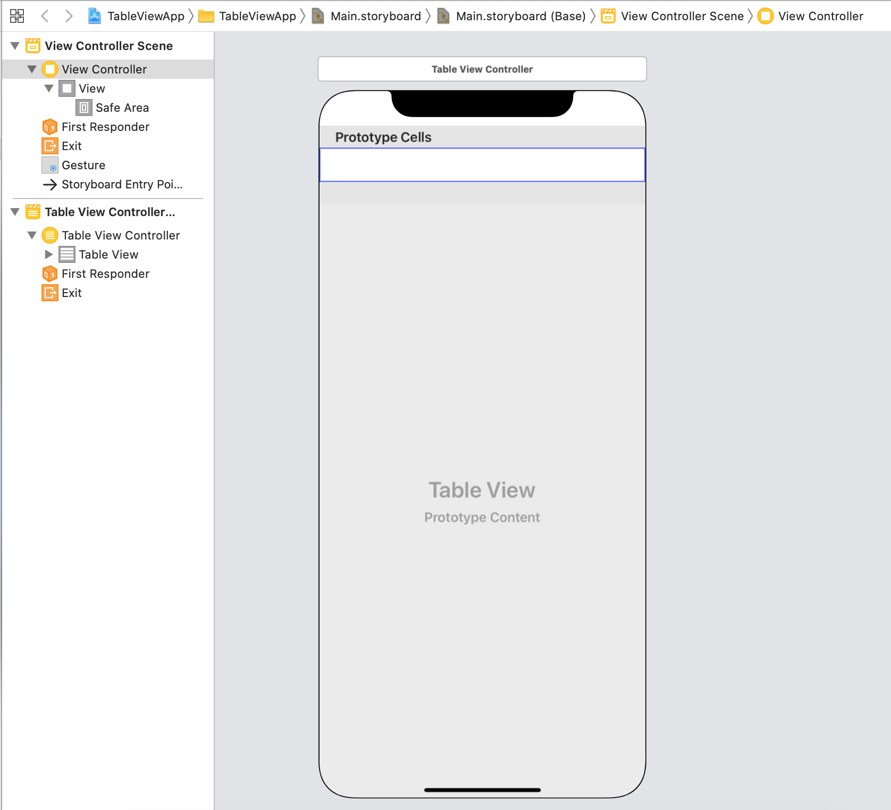
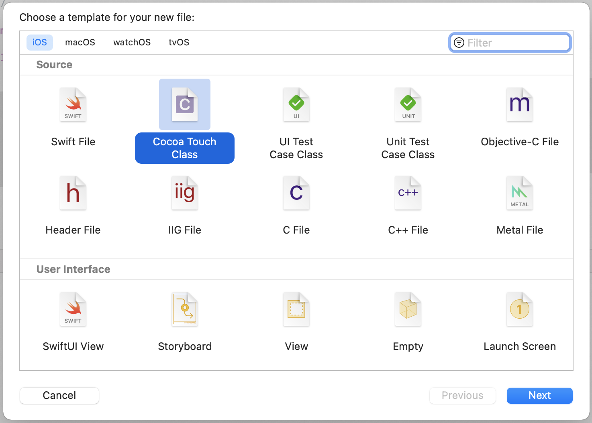

`Desarrollo Mobile` > `Swift Intermedio`


## Mostrando Info en un Table View


### OBJETIVO

- En este demo utilizaremos un TableView para mostrar cadenas de texto simples.


#### REQUISITOS

1. Xcode.
2. Proyecto terminado del Ejemplo-01 sobre TableViews.

#### DESARROLLO

1.- Con base al proyecto de TableView, asegurarse de tener almenos un TVC implementado.



2.- Crar un Array de Strings que será utilizado para mostrarse en la App.

```
let fruits = ["Apple", "Orange", "Blueberry"]

```

3.- Conectar el TVC con su DataSource y Delegate.

4.- Agregar un Section title.

5.- Ejecutar la App en almenos dos simuladores con pantallas distintas.

