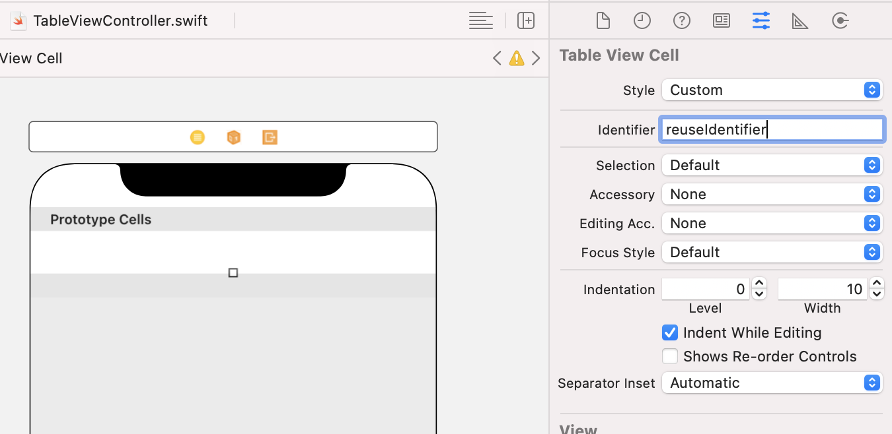

`Desarrollo Mobile` > `Swift Intermedio`

## Mostrando Info en un Table View

### OBJETIVO

- Utilizar un TableView para mostrar cadenas de texto simples.

#### REQUISITOS

1. Xcode.
2. Proyecto terminado del Ejemplo-01 sobre TableViews.

#### DESARROLLO

1. Con base al proyecto de TableView, asegurate de tener un TableViewController implementado.

   

2. Crea una clase que herede de UITableViewController y agrégala al proyecto

   - En el menú File, selecciona la opción New y luego File, aparecerá una imagen como esta:

     

   - Elige "Cocoa Touch Class" y clic en Next

   - En la siguiente pantalla, elige la clase padre de la cual heredará tu clase, como se muestra en esta imagen:

     

   - Elige "UITableViewController" en el combo **Subclass of**, y escribe un nombre para tu clase en el primer campo. Da clic en Next

   - Elige donde se guardará el nuevo archivo, normalmente debe ser la misma carpeta de los otros archivos del proyecto. Da clic en Finalizar.

3. Regresa al Storyboard y conecta esta nueva clase con el TableViewController que teníamos en el punto 1 como se muestra en la siguiente imagen:

   

4. En el panel de navegación, elige el archivo swift subclase de TableViewController que se creó en el punto 2

5. Crea un Array de Strings que será utilizado para mostrarse en la App.

   **let** fruits = ["Apple", "Orange", "Blueberry"]

    

6. Completar los métodos de DataSource y Delegate para que se pueda llenar el TableView (estos métodos ya se encuentran en el código de la clase porque seleccionamos el tipo de superclase UITableViewController)

   **override** **func** numberOfSections(in tableView: UITableView) -> Int {

   ​    **return** 1

     }

   

     **override** **func** tableView(**_** tableView: UITableView, numberOfRowsInSection section: Int) -> Int {

   ​    **return** 3

     }

   

     **override** **func** tableView(**_** tableView: UITableView, cellForRowAt indexPath: IndexPath) -> UITableViewCell {

   ​    **let** cell = tableView.dequeueReusableCell(withIdentifier: "reuseIdentifier", for: indexPath)

   ​    cell.textLabel?.text = fruits[indexPath.row]

   ​    **return** cell

     }

   **<u>NOTA:</u>** Observa que en el código de este último método, hay un string en el argumento **withIdentifier**: "reuseIdentifier". Es muy importante que este identificador, se asigne en el Storyboard al objeto prototype cells que está en el TableViewController, como se muestra en la siguiente imagen:

   

7. Agregar un Section title al TableView, mediante la implementación del siguiente método:

     **override** **func** tableView(**_** tableView: UITableView, titleForHeaderInSection section: Int) -> String? {

   ​    **return** "Fruits Catalog"

     }

   

8. Ejecutar la App en almenos dos simuladores con pantallas distintas.

