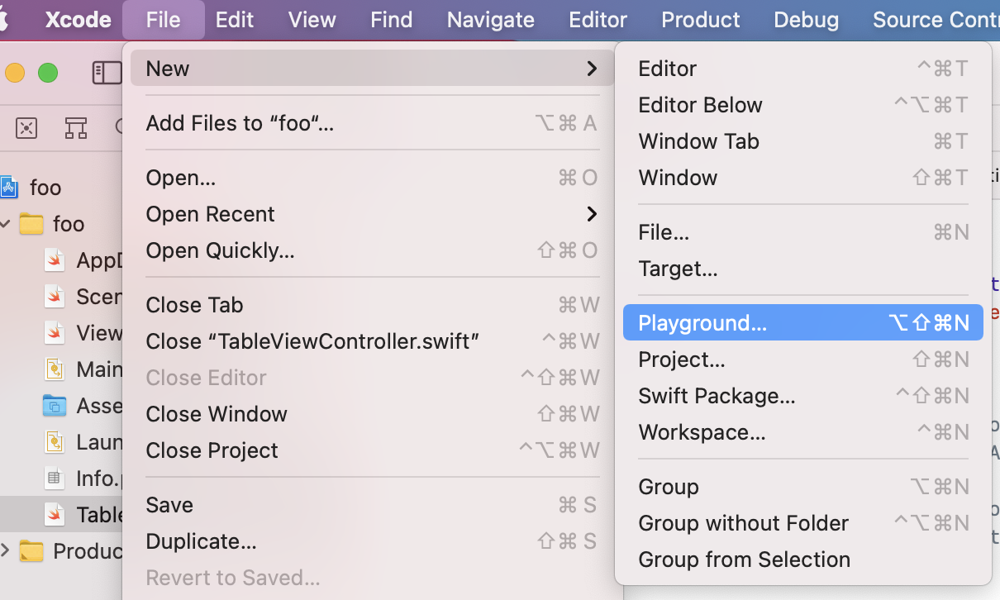

`Desarrollo Mobile` > `Swift Intermedio`


## Implementando Funciones


### OBJETIVO

- Reforzar la sintaxis de implementación de funciones en Swift, y las diferentes posibilidades de uso.


#### REQUISITOS

1. Xcode.

#### DESARROLLO

Para probar estos ejemplos de funciones, abre un playground desde el menú File->New->Playground, como se muestra en la siguiente imagen:




Una función es **un trozo de código con entidad propia que recibe o puede recibir unos valores y que devolverá o puede devolver un resultado**. 

Las funciones se declaran siempre con la palabra clave `func` seguida del nombre que queramos darle. Luego paréntesis, vacíos si la función no recibe parámetros de entrada y si no, separados por coma ponemos los parámetros y el tipo de los mismos. **Las funciones no tienen inferencia de tipos y siempre tenemos que indicar cuál es el de cada variable de entrada**.

Después del paréntesis derecho, si la función no va a devolver parámetros de salida que  con , directamente abrimos corchete y empezamos a escribir el cuerpo de la misma. En caso de querer usar de salida, usamos los símbolos `->` e indicamos el tipo o tipos de variables que vamos a devolver. **Podemos no usar nombre en cuyo caso se podrá acceder a ellas por índice o ponerles nombre para que sean más fáciles de identificar**.

Ejemplos de declaración de funciones:

```
// Sin parámetros de entrada ni salida
func tipoDispositivo() {
}

// Recibe el parámetro size de tipo Int
func tipoDispositivoVoid(size size:Int) {
}

// Recibe el parámetro size de tipo Int y devuelve un Bool
func tipoDispositivo(size:Int) -> Bool {
    return true
}

// Recibe dos parámetros de entrada width y height, ambos de tipo Float
func tipoDispositivoVoid(width:Float, height:Float) {
}

// Recibe los mismos dos y devuelve otros dos de tipo Int y String
func tipoDispositivo(width width:Float, height:Float) -> (Int, String) {
    return (3, "i")
}

// Recibe los mismos dos y devuelve
// otros dos de tipo Int y String con nombre
func tipoDispositivoLabels(width width:Float, height:Float) -> (valor: Int, cadena: String) {
    return (3, "i")
}
```

