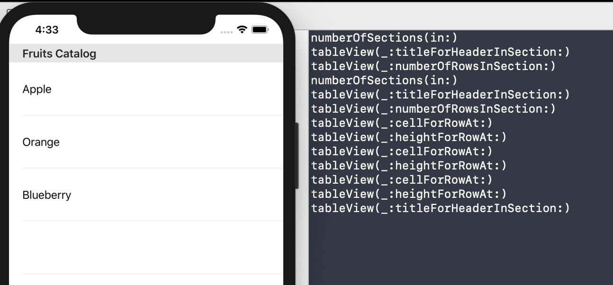

`Desarrollo Mobile` > `Swift Intermedio`


## Implementar el resto de funciones en el proyecto de TableView.


### OBJETIVO

- Implementar el resto de funciones en el proyecto de TableView.

- Utilizar la función **print()** para verificar que se esté ejecutando dicha función.


#### REQUISITOS

1. Xcode.

Proyecto terminado del Ejemplo-02 sobre TableViews con Delegate y DataSource conectados.

3. Se deben mostrar los elementos del Array.

#### DESARROLLO

1.- Con base en el Ejemplo-02 de TableViews continuar la app.

2.- En las funciones implementadas, incluir una función `print(#function)` y ver en el Debugger Area como se van ejecutando las funciones.

 Las funciones que deben cubrirse son al menos las siguientes:

```
cellForRowAt:

numberOfRowsInSection:

numberOfSections:

didSelectRowAt:

heightForRowAt:

```

Al finalizar de implementar este reto, debe seleccionarse cada celda y ver en el debugger area como se imprime el nombre de la función *didSelectRowAt*.

<details>
        <summary>Solución</summary>
<p>La función print() debe implementarse en cada función de TableView, ejemplo: </p>

```
  func tableView(_ tableView: UITableView, didSelectRowAt indexPath: IndexPath) {
    print(#function)
  }
```

<p>El resultado debe verse en el debugger: </p> 


                  
</details>

