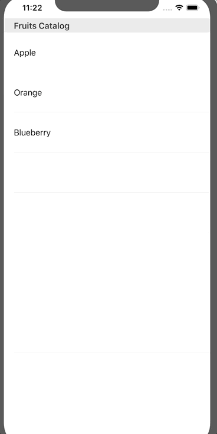

`Desarrollo Mobile` > `Swift Intermedio`


## Implementar una vista de detalle

### OBJETIVO

- Mostrar una vista de detalle al seleccionar una celda del TableView.

#### REQUISITOS

1. Xcode.

#### DESARROLLO

1.- Con base en el Ejemplo-02, implementar una vista de detalle.

2.- Al seleccionar una celda, se deberá navegar a esta vista.




<details>
        <summary>Solución</summary>
<p> Una vez abierto el proyecto del ejemplo-02, agregar un view controller nuevo: DetailViewController</p>

<p> En el Storyboard, agregamos el ViewController, le pondremos como id: DetailViewController </p>

<p> En el ViewController, implementamos una función que estará dentro de **didSelectRowAt:**, así podemos abrir la vista de detalle.</p>

```
  func showDetailView() {
    let storyBoard : UIStoryboard = UIStoryboard(name: "Main", bundle:nil)
    let vc = storyBoard.instantiateViewController(withIdentifier: "DetailViewController") as! DetailViewController
    self.present(vc, animated: true, completion: nil)
  }
```
                  
</details>


