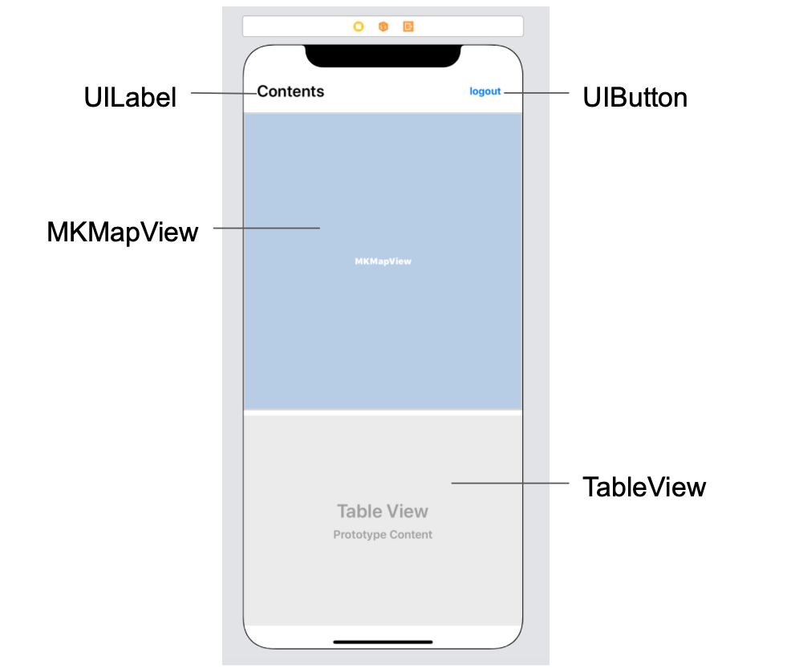
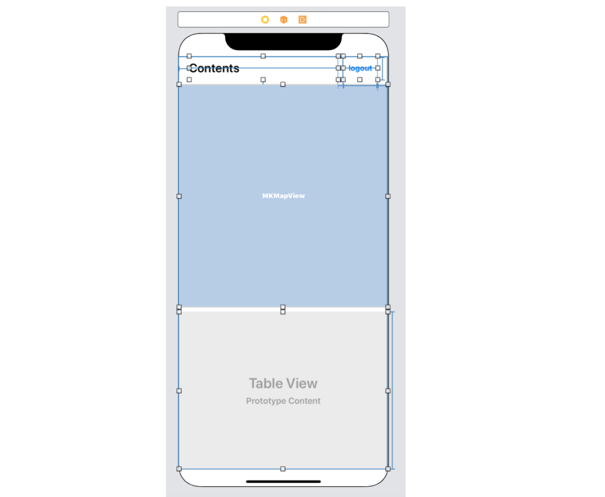
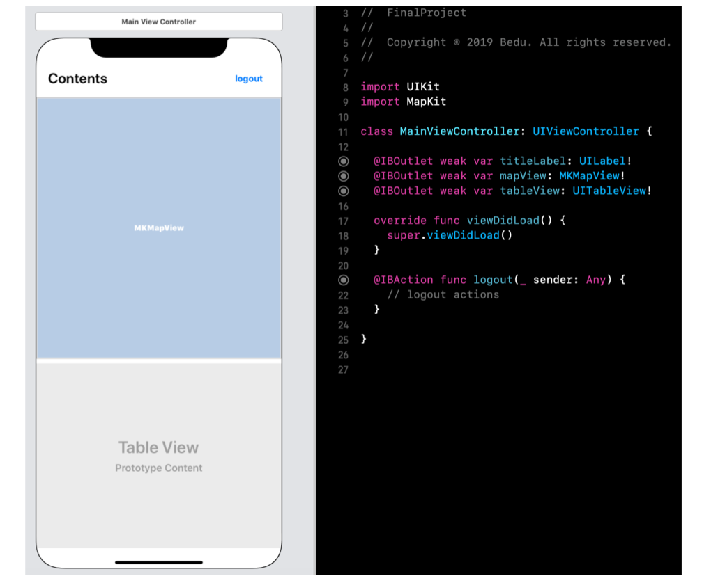

`Desarrollo Mobile` > `Swift Intermedio` 

## Componentes de UIKit

### OBJETIVO

- Aprender a utilizar algunos de los componentes de UIKit y conectarlos al ViewController.

- En el módulo anterior de *Swift Basics* se desarrolló una App sencilla de Login. 
En esta sesión continuaremos con su desarrollo.
Integraremos más componentes de UIKit.

#### REQUISITOS

1. Utilizar el [template](template) proporcionado.

#### DESARROLLO

1.- Comenzaremos el proyecto utilizando el Template proporcionado.

2.- En la vista posterior al Login, recrearemos el sig. Layout.

3.- Ajustar los constraints.

4.- Agregaremos el Framework de MapKit al proyecto.

5.- Conectamos los IBOutlets al ViewController.

6.- Agregaremos el Framework al ViewController correspondiente a esta nueva vista.

7.- Agregamos Delegates correspondientes.

