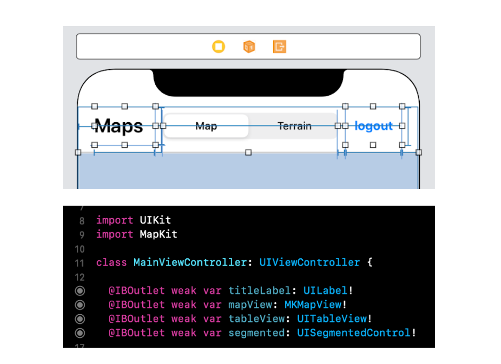
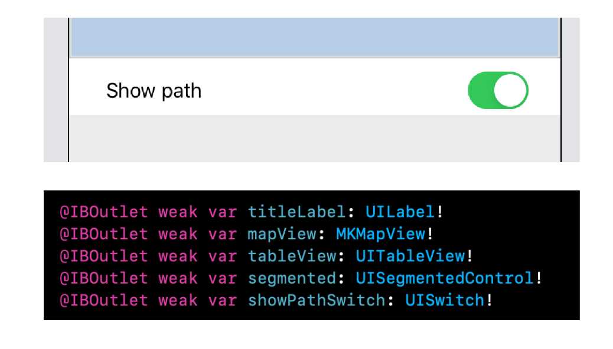
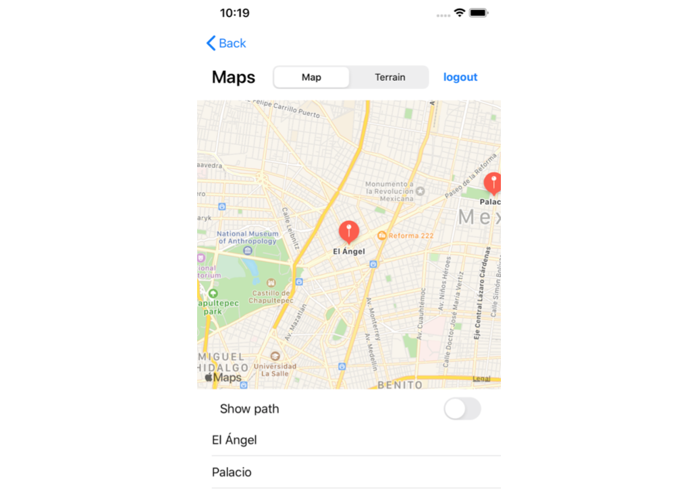

`Desarrollo Mobile` > `Swift Intermedio` 

## Integrando mas componentes de UIKit

### OBJETIVO

- Después de haber concluido el Reto-02, agregaremos mas componentes de UIKit.
- Al agregar mas elementos de UIKit también se reforzará el uso de Constraints.

#### REQUISITOS

1. Reto-02 concluido, este ejemplo se basará en dicho proyecto.

#### DESARROLLO

Es momento de agregar más componentes de UIKit a la vista.

1. Agregaremos un UISegmentedControl que permitirá cambiar el estilo del Mapa.
Además cambiaremos el Texto de Label y ajustaremos los constraints.

2. Agregaremos un UISwitch que mostrará el camino entre las ubicaciones. No olvides apagar por defecto el Switch.

El resultado final debe parecerse al de la sig. pantalla.

