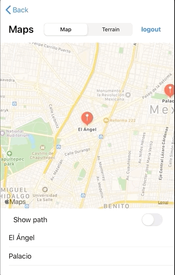

`Desarrollo Mobile` > `Swift Intermedio` 

## AlertViews

### OBJETIVO

- Aprender la implementación de AlertViews y UIAlertActions.

#### REQUISITOS

1. Reto-02 completado o en su defecto Ejemplo-02.

#### DESARROLLO

En nuestra app, agregaremos un AlertController en el botón de Logout.

1. Al presionar Sí o Confirmar deberá regresar a la pantalla de Login.

2. Al presionar Cancelar deberá simplemente desaparecer el Alert.

