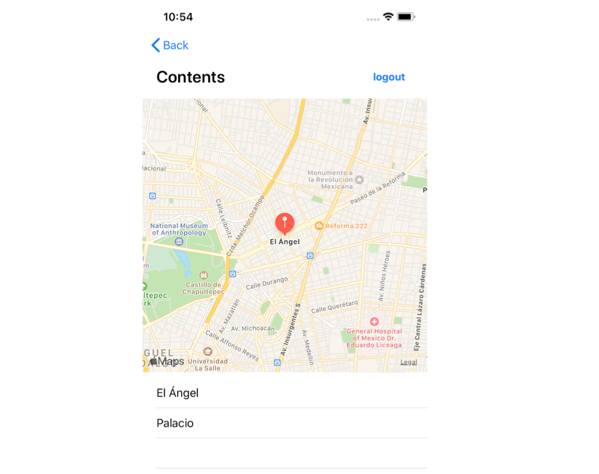

 `Desarrollo Mobile` > `Swift Intermedio` 
	
## Titulo del Ejemplo 

### OBJETIVO 

- Agregar funcionalidad al **Ejemplo-01**, mostrar pines en el mapa e integración con TableView.

#### REQUISITOS 

1. Haber concluido el Ejemplo-01 de componentes de UIKit.

#### DESARROLLO

Ya sabes mostrar elementos en un TableView.
Es momento de agregar dos elementos al TableView.

1. Agregar dos elementos en la lista del TableView, estos elementos son las ubicaciones que tenemos disponibles de momento.

	- Angel de la Independencia
	- Palacio de Bellas Artes.

2. Estos dos elementos deben mostrarse en el TableView como un texto y pines en el mapa.



<details>
        <summary>Solución</summary>
<p>  Dentro de MainViewController debemos tener los elementos de UIKit: titleLabel, mapView, tableView. </p>
<p>  Se debe contar con un array para almacenar los nombres de las ubicaciones. </p>

```
var locations: [String] = []
```

<p> El mapa debe configurarse para poner dos pines en el mapa de la siguiente manera. </p>

```
let coordinates = Coordinates()
    let locationAngel = CLLocationCoordinate2D(latitude: coordinates.angel.lat,
                                               longitude: coordinates.angel.long)
    let locationPalace = CLLocationCoordinate2D(latitude: coordinates.palace.lat,
                                                longitude: coordinates.palace.long)
    
    locations.append(coordinates.angel.name)
    locations.append(coordinates.palace.name)

    let span = MKCoordinateSpan(latitudeDelta: 0.05, longitudeDelta: 0.05)
    let region = MKCoordinateRegion(center: locationAngel, span: span)
    mapView.setRegion(region, animated: true)

    addAnnotation(coordinate: locationAngel,
                  name: coordinates.angel.name,
                  subtitle: coordinates.angel.subtitle)
    
    addAnnotation(coordinate: locationPalace,
                  name: coordinates.palace.name,
                  subtitle: coordinates.palace.subtitle)

```


</details>
