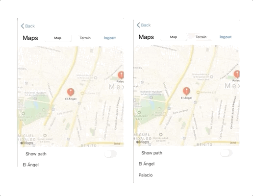

 
`Desarrollo Mobile` > `Swift Intermedio` 
	
## Agregando funcionalidad al nuevo Layout 

### OBJETIVO 

- Una vez agregado mas componentes de UI a la app, el alumno deberá poder asignar sus IBActions e implementar la funcionalidad correspondiente. 

#### REQUISITOS 

1. Ejemplo-02 concluido, servirá de base para este reto.

#### DESARROLLO

Hasta ahora solo hemos conectado los nuevos componentes de UI.
Es momento de agregar la funcionalidad.

1. Agregaremos un IBAction conectado al UISwitch para mostrar nuestra  el camino entre pines.

2. Agregaremos un IBAction al UISegmentedControl para cambiar el estilo del mapa.



<details>
	<summary>Solución</summary>
	<p>La funcionalidad del Switch para mostrar el camino entre pines: </p>
	
```
  @IBAction func showPath(_ sender: Any) {
    if showPathSwitch.isOn {
      let coordinates = Coordinates()
      let locationAngel = CLLocationCoordinate2D(latitude: coordinates.angel.lat, longitude: coordinates.angel.long)
      let locationPalace = CLLocationCoordinate2D(latitude: coordinates.palace.lat, longitude: coordinates.palace.long)
      let sourcePlacemark = MKPlacemark(coordinate: locationAngel, addressDictionary: nil)
      let destinationPlacemark = MKPlacemark(coordinate: locationPalace, addressDictionary: nil)
      let sourceMapItem = MKMapItem(placemark: sourcePlacemark)
      let destinationMapItem = MKMapItem(placemark: destinationPlacemark)
      directions(source: sourceMapItem, destination: destinationMapItem)
    } else {
      self.mapView.removeOverlays(self.mapView.overlays)
    }
  }
```

<p> El IBAction para cambiar el estilo de los mapas: </p>

```
@IBAction func changeMapStyle(_ sender: Any) {
    if segmented.selectedSegmentIndex == 0 {
      mapView.mapType = .standard
    } else {
      mapView.mapType = .satellite
    }
  }
```
</details> 

