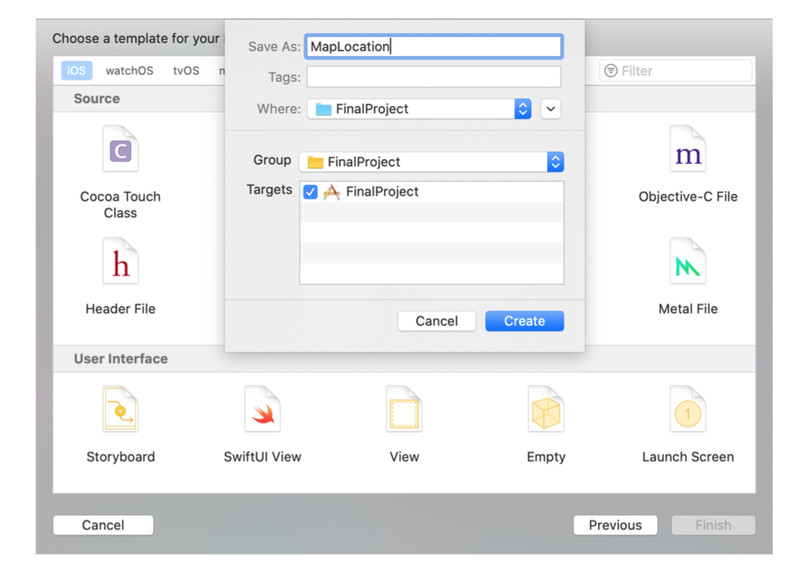

 
`Desarrollo Mobile` > `Swift Intermedio` 
	
## Refactor de Código

### OBJETIVO 

- Aprender a realizar una refactorización de código mediante la creación de Clases.

#### REQUISITOS 

1. Es necesario contar con el código del Ejemplo-03, se basará este reto en dicho proyecto.

#### DESARROLLO

1. Crearemos un nuevo archivo de Swift, MapLocation.swift. Dentro de este implementaremos el código relacionado con Mapas.



2. Del código del Ejemplo-03, identificar aquellas lineas de código relacionadas con mapas y ubicación y moverlas a la Clase de MapLocation.

3. Reimplementar el código en el ViewController, ahora como una instancia de la clase MapLocation.

<details>
	<summary>Solución</summary>
	<p> La clase MapLocation agrupa la funcionalidad de agregar Annotations, trazar ruta entre puntos, calcular regiones, renderizar y los parámetros para solicitar la polilínea de la ruta.</p>

```
import UIKit
import MapKit

class MapLocation {
  
  let coordinates = Coordinates()
  var annotations: [MKPointAnnotation] = []
  
  func getLocationsNames() -> [String] {
    var locations: [String] = []
    locations.append(coordinates.angel.name)
    locations.append(coordinates.palace.name)
    return locations
  }
  
  func routePoints() -> (source: MKMapItem, destination: MKMapItem) {
    let locationAngel = CLLocationCoordinate2D(latitude: coordinates.angel.lat, longitude: coordinates.angel.long)
    let locationPalace = CLLocationCoordinate2D(latitude: coordinates.palace.lat, longitude: coordinates.palace.long)
    let sourcePlacemark = MKPlacemark(coordinate: locationAngel, addressDictionary: nil)
    let destinationPlacemark = MKPlacemark(coordinate: locationPalace, addressDictionary: nil)
    let source = MKMapItem(placemark: sourcePlacemark)
    let destination = MKMapItem(placemark: destinationPlacemark)
    return (source, destination)
  }
  
  func generateAnnotations() {
    let locationAngel = CLLocationCoordinate2D(latitude: coordinates.angel.lat, longitude: coordinates.angel.long)
    let locationPalace = CLLocationCoordinate2D(latitude: coordinates.palace.lat, longitude: coordinates.palace.long)
    addAnnotation(coordinate: locationAngel, name: coordinates.angel.name, subtitle: coordinates.angel.subtitle)
    addAnnotation(coordinate: locationPalace, name: coordinates.palace.name, subtitle: coordinates.palace.subtitle)
  }
  
  func addAnnotation(coordinate: CLLocationCoordinate2D, name: String, subtitle: String) {
    let annotation = MKPointAnnotation()
    annotation.coordinate = coordinate
    annotation.title = name
    annotation.subtitle = subtitle
    annotations.append(annotation)
  }
  
  func calculateRegion() -> MKCoordinateRegion {
    let locationAngel = CLLocationCoordinate2D(latitude: coordinates.angel.lat, longitude: coordinates.angel.long)
    let span = MKCoordinateSpan(latitudeDelta: 0.05, longitudeDelta: 0.05)
    let region = MKCoordinateRegion(center: locationAngel, span: span)
    return region
  }
  
  func renderStyle(_ overlay: MKOverlay) -> MKPolylineRenderer {
    let renderer = MKPolylineRenderer(overlay: overlay)
    renderer.strokeColor = UIColor.red
    renderer.lineWidth = 4.0
    return renderer
  }
  
  func directionsRequest(from source: MKMapItem, to destination: MKMapItem) -> MKDirections {
    let directionRequest = MKDirections.Request()
    directionRequest.source = source
    directionRequest.destination = destination
    directionRequest.transportType = .automobile
    return MKDirections(request: directionRequest)
  }
}
```

</details> 
