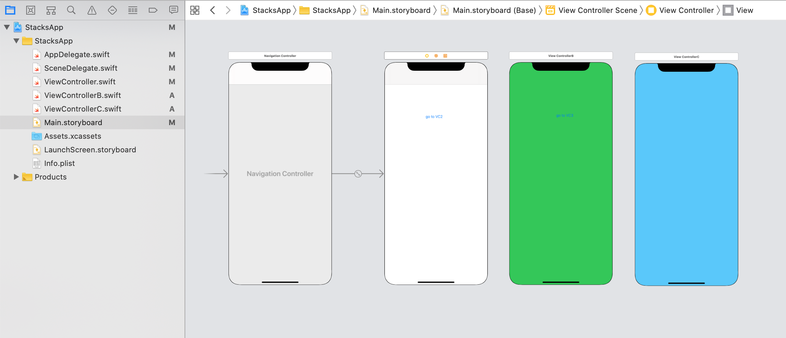

`Desarrollo Mobile` > `Swift Intermedio` 

## UINavigation Controller, navigation stack

### OBJETIVO

- Aprender como funciona el sistema de stacks al presentar una vista.

#### REQUISITOS

1. Xcode

#### DESARROLLO

En esta sesión nos enforamemos en el Navigaton Stack.
Antes de comenzar, un objeto de tipo navigation controller maneja sus vistas utilizando un Array, conocido como navigation stack.

El primer view controller en el array es el **Root** View Controller y representa el stack que esta *mas al fondo*. El último VC en el array, él que esta mas por encima de todos y representa el ViewController que será mostrado, a este VC se le conoce como **the topmost item**.


#### Como enviar un ViewController al Top del Navigation Stack

Partiendo de la vista correspondiente a **ViewControllerA** pasaremos a un nuevo VC, **ViewControllerB**.

1. Crearemos un nuevo proyecto, luego agregaremos dos VC en el Storyboard. Nos aseguramos de agregar el Navigation.



2. Mediante un **Push** navegaremos del `VC1 -> VC2`.

```
let storyBoard : UIStoryboard = UIStoryboard(name: "Main", bundle:nil)
let viewControllerB = storyBoard.instantiateViewController(withIdentifier: "VC2") as! ViewControllerB  
self.navigationController?.pushViewController(viewControllerB, animated: true)
```

Ahora tenemos dos VC en el Stack, el VC2 es el **topmost item**.

#### Como reemplazar un ViewController en el Stack

Ahora que tenemos un stack de VC, podemos manipular un poco el orden.

Agregaremos un tercer VC, este viewController reemplazará la posición del VC2.

3. Creamos una instancia de VC3:

```
let storyBoard : UIStoryboard = UIStoryboard(name: "Main", bundle:nil)
let viewControllerC = storyBoard.instantiateViewControllerWithIdentifier("VC3") as! ViewControllerC
```

4. Obtenemos la lista de VC.

```
var stack = self.navigationController?.viewControllers
```

5. Removemos el último VC, el correspondiente a VC2.

```
stack!.removeLast()
```

6. Agregamos el VC a nuestro Stack.

```
stack!.append(viewControllerC)
```

7. Pasamos el stack al navigation controller.

```
self.navigationController?.setViewControllers(stack!, animated: true)
```

Ahora veamos todo el código en un solo `IBAction`:

```
@IBAction func buttonAction(_ sender: Any) {
let storyBoard : UIStoryboard = UIStoryboard(name: "Main", bundle:nil)
let viewControllerC = storyBoard.instantiateViewController(withIdentifier: "VC3") as! ViewControllerC
var stack = self.navigationController?.viewControllers
stack!.removeLast()
stack!.append(viewControllerC)
self.navigationController?.setViewControllers(stack!, animated: true)
}
```

#### Como pasar al ViewControllerC y convertirlo en el RootViewController

1.  Para lograr esto, necesitamos hacer que el RootViewController sea el ViewControllerC, haciendo este VC el primero en el Stack.

```
private func removeAll() {
let storyBoard : UIStoryboard = UIStoryboard(name: "Main", bundle:nil)
let viewControllerC = storyBoard.instantiateViewController(withIdentifier: "VC3") as! ViewControllerC
var stack = self.navigationController?.viewControllers
stack!.removeAll()
stack!.append(viewControllerC)
self.navigationController?.setViewControllers(stack!, animated: true)
}
```

#### Resultados

Navegando al VC3 y al regresar nos saltamos el 2do VC:


Navegando hasta el VC3, y volviendolo RootViewController.


