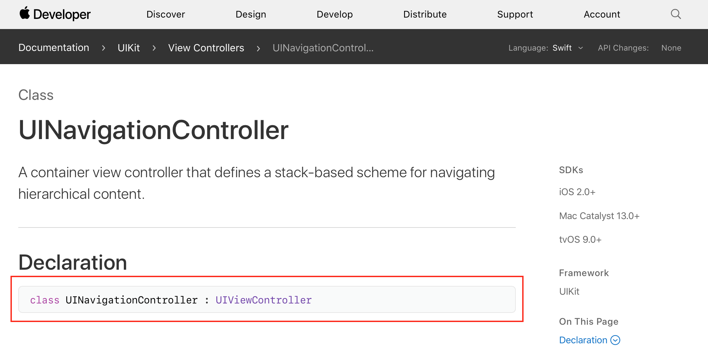
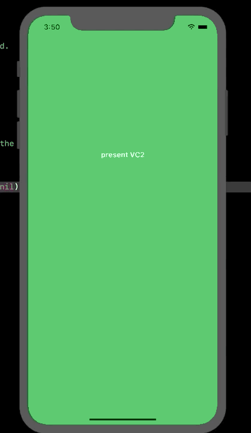
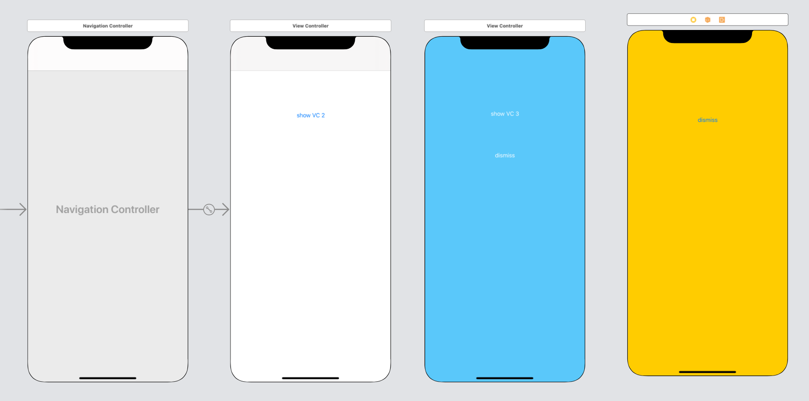

`Desarrollo Mobile` > `Swift Intermedio` 

## Pushing, Popping, Presenting, y Dismissing ViewControllers

### OBJETIVO

- Aprender las diferencias entre las operaciones para mostrar y ocultar ViewControllers.

#### REQUISITOS

1.- Xcode 11

#### DESARROLLO

En esta fase del desarrollo se ha aprendido que para mostrar un ViewController utilizamos la función `push()`.

En el siguiente ejemplo implementaremos cada uno de los siguientes puntos.

0.- Creamos un nuevo proyecto en Xcode, con Swift y Storyboards. Luego creamos un flujo de tres vistas de navegación.

Veamos los sig. ejemplos:

1.- Tanto `UIViewController` como `UINavigationController` son de tipo `UIViewController`. Es decir, un `UINavigationController` hereda de un `UIViewController`. De acuerdo a la documentación oficial de Apple:



Un `UINavigationController` tendra un Array de *ViewControllers*, conocido como el Stack.

Dicho esto, un `UIViewController` que fué presentado de manera *modal* debe utilizar la operación *dismiss* para ocultarlo.

```
// UINavigationController presented modally
navigationController?.dismiss(animated: true, completion: nil)

// UIViewController presented modally
let vc = ViewController()
vd.dismiss(animated: true, completion: nil)
```

**Realizar**: 
> Mostrar un ViewController mediante *push* o *present* y en el segundo ViewController regresar mediante *dismiss*.



2.- Ya que los `UINavigationController` poseen un `UIViewController` en su *Stack*, pueden ser presentados tanto de manera **modal** o por via **push**. Entonces, una vez *Pusheado* un ViewController si queremos regresar a la vista anterior utilizamos un *Pop*.

Vemos que estas operaciones son propias de la estructura de datos: **Stack**

```
// UINavigationController pops the current UIViewController that was pushed
navigationController?.popViewController(animated: true)

// UINavigationController pops to a specific UIViewController that was pushed within the UINavigationController's stack
let vc = ViewController()
navigationController?.popToViewController(vc, animated: true)

// UINavigationController poops to the rootViewController (the first VC on the navigation's stack)
navigationController?.popToRootViewController(animated: true)
```

**Realizar**: 
> Crear un flujo de navegación entre tres ViewControllers, en el tercer ViewController implementar las operaciones de Pop mencionadas.




3.- Aunque es posible presentar `UIViewControllers` tanto de manera modal como por push, los `UIViewControllers` solo pueden mostrar otros `UIViewControllers`. Por lo tanto, `UIViewControllers` solo pueden ser eliminados del Stack mediante *dismiss*, a menos que ellos esten dentro de un `UINavigationController` Stack.


