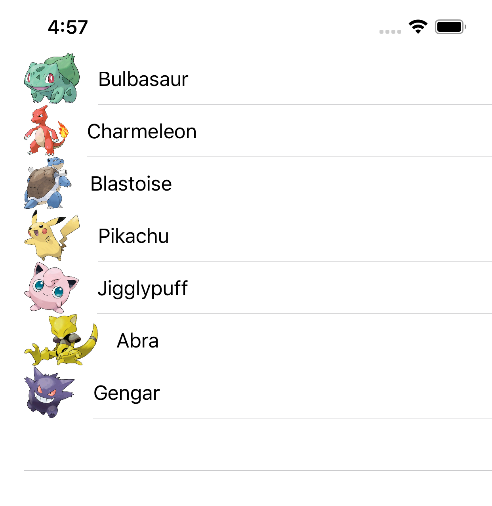
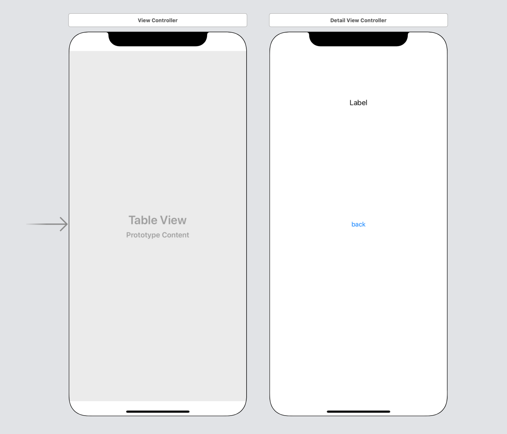
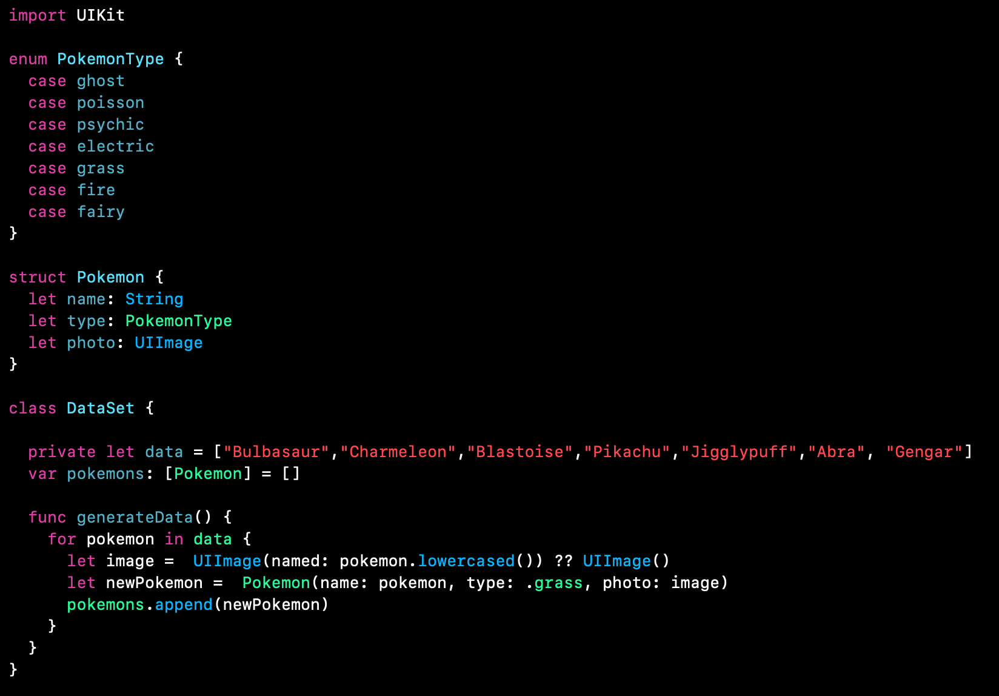
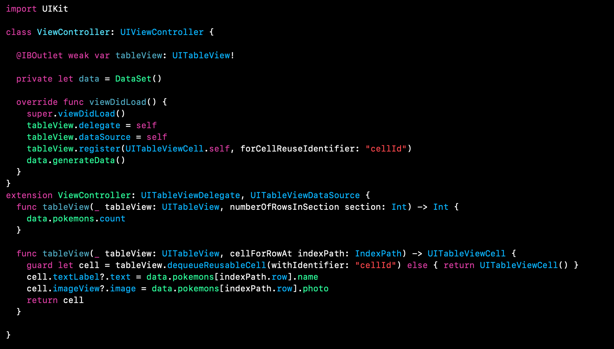
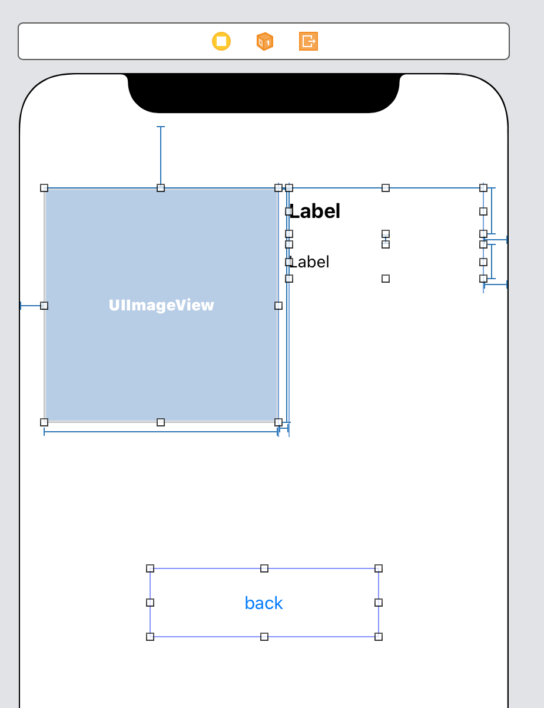
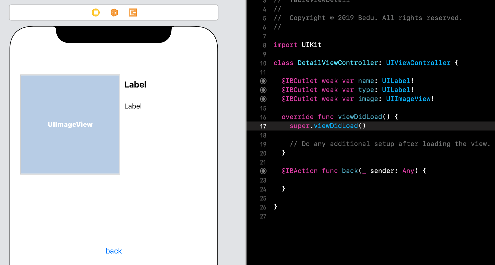
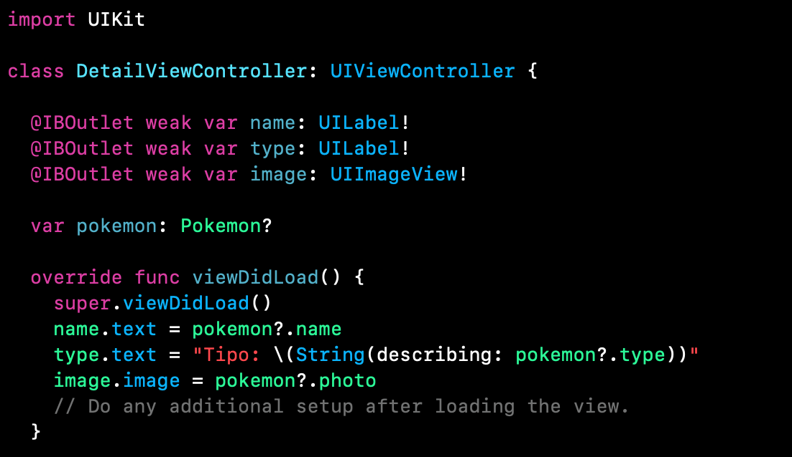
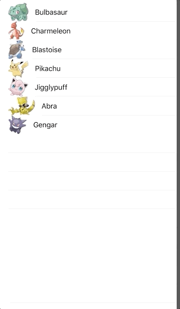

`Desarrollo Mobile` > `Swift Intermedio` 

## Pasando datos entre ViewControllers

### OBJETIVO

- Aprender a pasar información entre diferentes vistas de navegación.

#### REQUISITOS

1. Xcode
2. Comprender la implementación de TableViews y NavigationController.

#### DESARROLLO

En este ejemplo veremos como enviar datos a una vista de detalle. Se seleccionará un TableView cell y en la vista de detalle veremos la info correspondiente al elemento seleccionado.

1.- Crearemos un TableView con la información deseada (ejemplo Pokemons).



2.- Creamos un nuevo proyecto de Xcode, con Swift y Storyboards. En el Storyboard crearemos dos ViewControllers y también crearemos su archivo de Clase .swift.



3.- Procedemos a la conexión de elementos de UI con sus respectivos ViewControllers.

4.- Crearemos un `DataModel`, esta clase se encargará de teneer la información a mostrar.
Para ello nos apoyaremos de usos de Enums y Structs. Ejemplo:



5.- Regresando a nuestro ViewController principal (en donde esta nuestro TableView), mostraremos esta data del modelo de la sig. manera.



6.- En la vista de detalle implementaremos el sig. Layout. 



7.- Por supuesto, conectamos los elementos con sus ViewController.



8.- Ya aprendimos a hacer una funcion de **Pop/Dismiss**, entonces agregamos dicha funcionalidad al IBAction de back.

9.- En la función viewDidLoad, asignaremos los datos recibidos. Para poder recibir datos del TableView debemos primero identificar que Tipo de Dato necesitamos.

En este caso estamos utilizando una Estructura de tipo *Pokemon*, entonces en nuestra vista de detalle utilizaremos una variable de tipo *Pokemon*. Luego asignaremos los valores correspondientes a nuestros IBOutlets.



10.- Implementamos en la vista principal donde tenemos el TableView la funcion de ir a la vista de detalle al seleccionar una celda. Para ello pasamos la variable Pokemon.

```
  func tableView(_ tableView: UITableView, didSelectRowAt indexPath: IndexPath) {
    let pokemon = data.pokemons[indexPath.row]
    let vc = storyboard?.instantiateViewController(identifier: "detailViewController") as! DetailViewController
    vc.pokemon = pokemon
    self.present(vc, animated: true, completion: nil)
  }
```

11.- Resultado Final.




