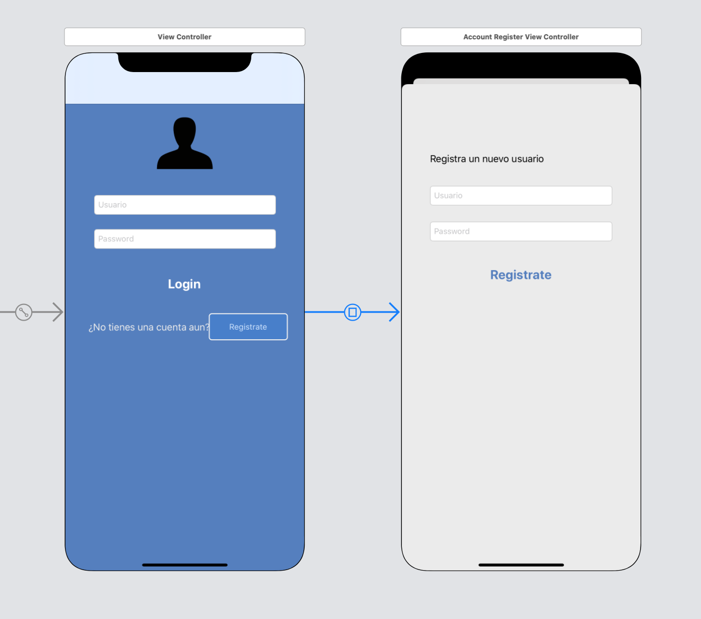

 
`Desarrollo Mobile` > `Swift Intermedio` 
	
## Navegación completa por código

### OBJETIVO 

- En la sesión 3 realizamos un proyecto de una app con login y vista de mapas. En este reto utilizaremos el proyecto final para implementar los flujos de navegación mediante código únicamente.

#### REQUISITOS 

1. Proyecto final de la sesión 03 funcionando.


#### DESARROLLO

1.- Abrir el Proyecto Final.

2.- Dirigirnos al Storyboard y detectar el Segue:



3.- Lo eliminamos e implementamos el código para mostrar esa misma vista.

<details>
        <summary>Solución</summary>
<p> Una vez eliminado el Segue que conecta a Login con Register...</p>

<p> Agregar un ID al Viewcontroller de Registro de cuenta.</p>

<p> Ir al ViewController de login y agregar un IBAction al botón Registrar.</p>

<p> Este IBAction implementará el sig. código: </p>

```
  @IBAction func register(_ sender: Any) {
    let vc = storyboard?.instantiateViewController(identifier: "registerVC") as! AccountRegisterViewController
    self.navigationController?.pushViewController(vc, animated: true)
  }
```

</details>
