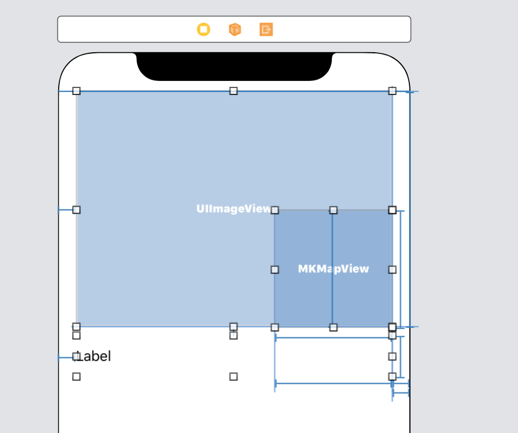

 
`Desarrollo Mobile` > `Swift Intermedio` 
	
## Agregando vista de detalle a App de Login/Maps

### OBJETIVO 

- Reforzar el conocimiento adquirido de como implementar DetailViews a partir de un TableView.

#### REQUISITOS 

1. **Reto-02** terminado y funcionando, de no ser posible, proyecto final de la **Sesión-03**.

#### DESARROLLO

1.- Una vez abierto el proyecto, dirigete a `MainViewController` e implementa la función:

> func tableView(_ tableView: UITableView, didSelectRowAt indexPath: IndexPath)

2.- Esta función debera abrir una vista de detalle donde muestre información del destino seleccionado.

Puedes mostrar desde Nombre, Mapa, y Alguna foto del lugar.



Si lo deseas implementa un Modelo que ayude a pasar los datos a la vista de Detalle.


<details>
        <summary>Solución</summary>
<p> Para implementar la función didSelectRowAt: </p>
<p> Ojo cabe mencionar que en este caso estamos pasando las coordenadas, pero lo ideal seria pasar un modelo. </p>
```

func tableView(_ tableView: UITableView, didSelectRowAt indexPath: IndexPath) {
    let coordinates = mapLocation.coordinates
    let vc = storyboard?.instantiateViewController(identifier: "DetailViewController") as! DetailViewController
    vc.coordinates = coordinates
    self.navigationController?.pushViewController(vc, animated: true)
  }
```

<p> En el ViewDidLoad de DetailViewController, asignar los valores de texto e imagen a los IBOutlets. </p>
</details>

  
  
