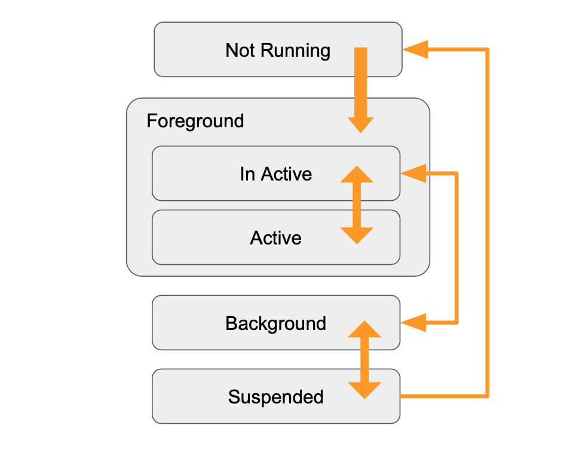
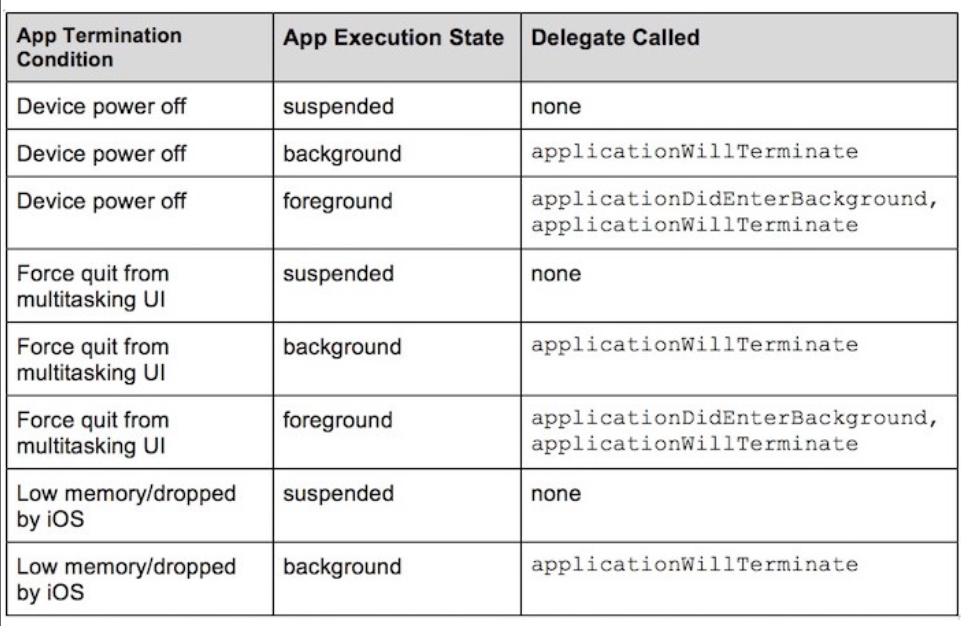
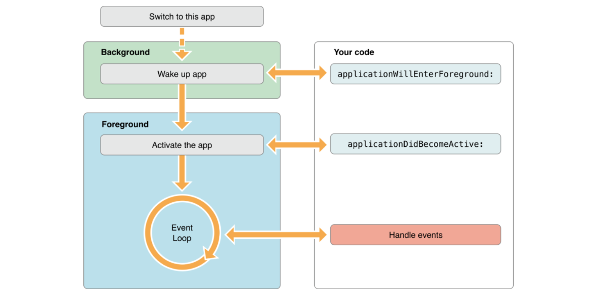
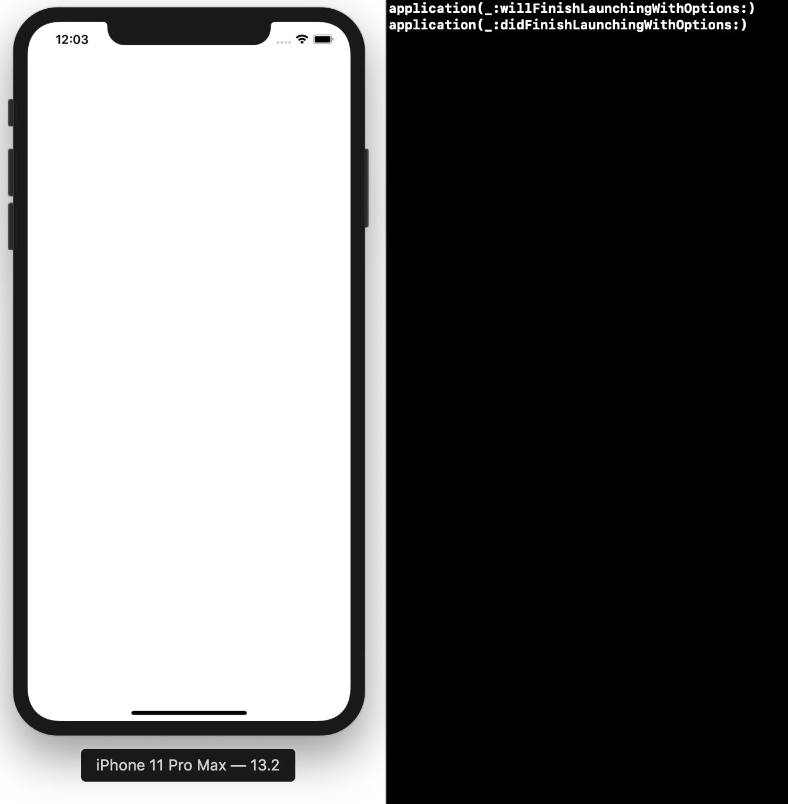

`Desarrollo Mobile` > `Swift Intermedio` 

## App’s Life Cycle


### OBJETIVO

- Aprender como funcionan los métodos en el ciclo de vida de una App.

#### REQUISITOS

1. Xcode 11

#### TEORIA

**UIApplication**

UIApplication es un objeto que representa a nuestra App.  Configura todo e inicia nuestra App. `UIApplication` notifica a través de `UIApplicationDelegate`.


**App’s Life Cycle**

Nos sirve para responder a notificaciones de sistema cuando la App está trabajando tanto en el Background como Foreground.

**States**

Cada app en iOS tiene los siguientes estados:



**NotRunning**: Este estado es cuando la App no ha iniciado aún o se encontraba en ejecución y ha sido terminada por el sistema.

**Inactive**:
Una App que está corriendo pero no recibe eventos. Ej. cuando recibimos una llamada o mensaje y la app.

**Active**: Es cuando la app está recibiendo eventos. El usuario está interactuando con la UI.

**Background**:
Una App esta en ejecución pero minimizada o como se conoce, corriendo en el background.

**Suspended**:
Una App que está en el background pero no está ejecutando nada. En caso de que el sistema se quede sin memoria, eliminaría apps en este estado.

#### Methods



**application:willFinishLaunchingWithOptions:** Este método es llamado despues de que la App ha sido ejecutada satisfactoriamente. También es el primer método a llamar en el Delegate.

**application:didFinishLaunchingWithOptions: **Este método es llamado antes de que la Ventana de la App sea mostrada.

**applicationWillResignActive:** Este método es llamado para decirle a la App que está a punto de moverse del estado activo a inactivo. Esto pasa cuando ocurre una interrupción (como una llamada entrante) o cuando el usuario quita la App. Usamos este método para Pausar cualquier tarea que se esté ejecutando (como un timer).

**applicationDidEnterBackground:** Este método es llamado para decirle a la app que  no se está corriendo en el Foreground. Tenemos 5 segundos para ejecutar cualquier tarea antes de regresar y ejecutar la app. Si necesitamos mas tiempo, lamamos a  beginBackgroundTask(expirationHandler:). Si el método no es retornado antes de que el tiempo transcurra, la app muere.

**applicationWillEnterForeground: **Este método es llamado como parte de la transición del Background a un estado Activo. Usamos este método para deshacer cualquier cambio hecho a la app al entrar al Background. applicationDidBecomeActive es llamado tan pronto como este método ha terminado su ejecución, el cual mueve la app desde un estado inactivo a uno activo.

**applicationDidBecomeActive:** Este método es permite reanudar tareas cuando la app se puso en pausa o no iniciadas mientras la app estaba inactiva.

**applicationWillTerminate:** Este método es llamado para decirle a la App que está a punto de terminar. La idea de este método es ejecutar una tarea final de limpieza. Tenemos 5 segundos para ejecutar cualquier tarea.



#### DESARROLLO

1.- Crear un nuevo proyecto de Xcode.

2.- Implementar las funciones siguientes en el App **Delegate**.

```
application:willFinishLaunchingWithOptions:

application:didFinishLaunchingWithOptions:

```

3.- En cada una de estas funciones apoyarnos de un:

> print(#function)




