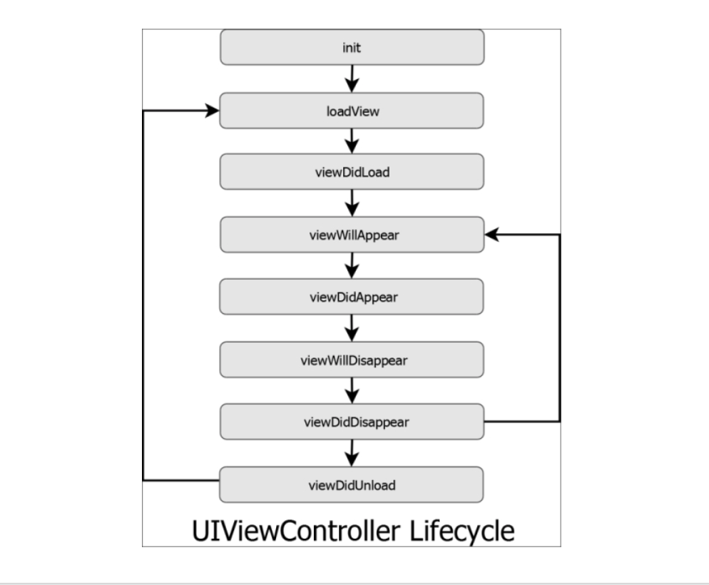
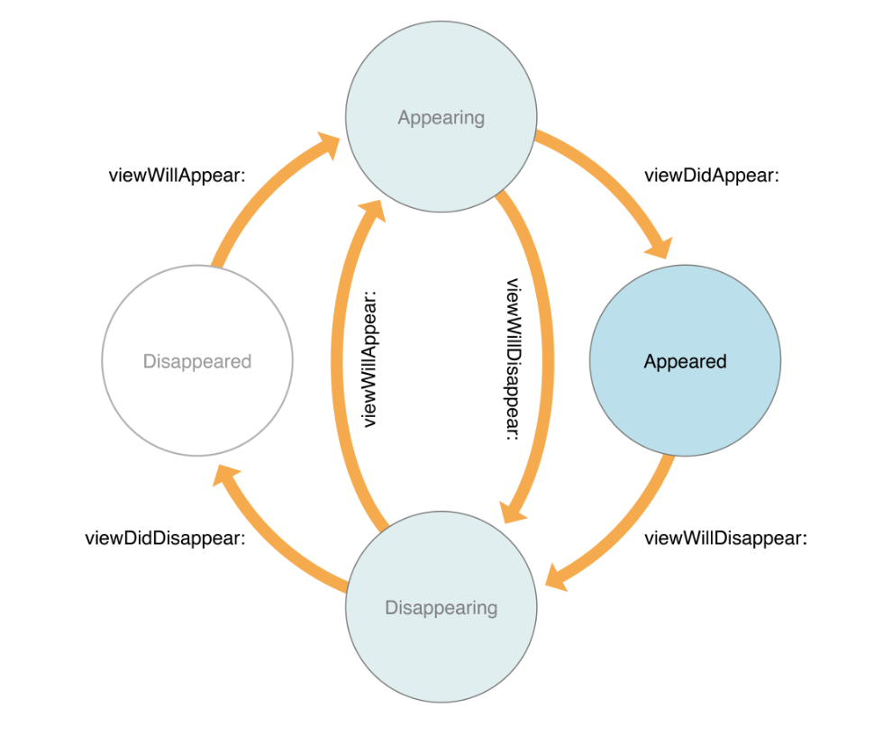

`Desarrollo Mobile` > `Swift Intermedio` 

## Ciclo de vida de un ViewController

### OBJETIVO

- - Aprender como funcionan los métodos en el ciclo de vida de un ViewController.

#### REQUISITOS

1. Xcode 11

#### TEORIA

Cabe mencionar que el ciclo de vida de un UIView y de un UIViewController son diferentes.

Un UIView trata de una vista, de su jerarquía de subvistas y de cómo su contenido es renderizado.

Mientras un UIViewController trata del ciclo del Controlador.

Al cargar un ViewController, la secuencia de métodos de ciclo de vida se ejecutan en el sig. orden.

Un ViewController Aparece en la pantalla, entonces es Visible. 

Cuando se oculta entonces se dice que desaparece. 

### WILL and DID

Los métodos con **Will** preparan para los eventos de mostrar/ocultar.

Los métodos con **Did** son ejecutados cuando han completado dichas acciones.

Una vez ejecutado un método **Will**, se ejecutará uno **Did**.

#### DESARROLLO

1.- Crear un nuevo proyecto de Xcode, con Swift y Storyboards como configuración inicial.

2.- Dentro de **ViewController** implementar los métodos vistos.

> Utilizar la función:

> print(#function)

*Tip*: No olvides invocar al constructor de la clase padre.

