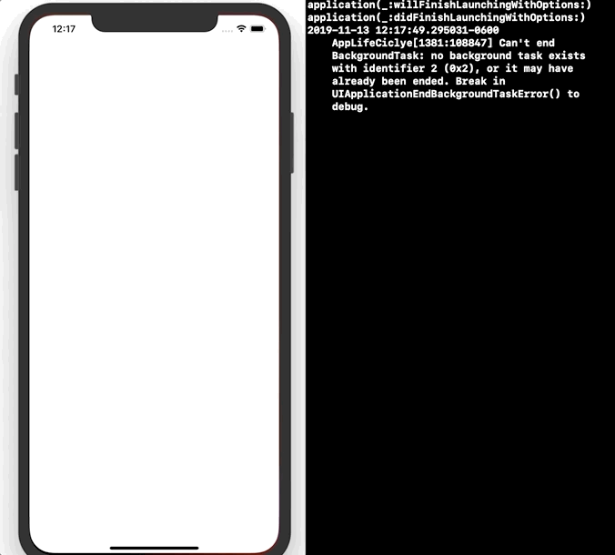

 
`Desarrollo Mobile` > `Swift Intermedio` 
	
## Reto App’s Life Cycle

### OBJETIVO 

- Aprender como funcionan los métodos en el ciclo de vida de una App. 

#### REQUISITOS 

1. Xcode 11

#### DESARROLLO

Con base al proyecto del **Ejemplo-01**, implementar las funciones de ciclo de vida:

```
applicationDidEnterBackground

applicaitionWillTerminate

```



<details>
        <summary>Solución</summary>
<p> Dentro del AppDelegate implementar las funciones.</p>

```
 func applicationWillTerminate(_ application: UIApplication) {
    print(#function)
  }
  
  func applicationDidEnterBackground(_ application: UIApplication) {
    print(#function)
  }
```
</details>


