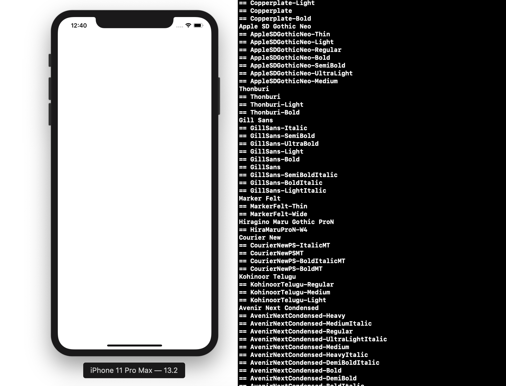

`Desarrollo Mobile` > `Swift Intermedio` 
	
## Tipografía del sistema

### OBJETIVO 

- Familiarizarse mas con el uso de métodos de App Life cycle. 
- Aprender con que tipos de letra contamos en una App.

#### REQUISITOS 

1. Xcode 11 

#### DESARROLLO

Dentro del AppDelegate, implementar en algún método del ciclo de vida de la app un código que permita mostrar los nombres de los tipos de letra disponibles para UI.

>Familia de tipografía: UIFont.familyNames
>
>Nombres de tipografía: UIFont.fontNames(...)


<details>
        <summary>Solución</summary>
<p> Dentro del Delegate del proyecto creado, implementar dos ciclos for. Uno anidado en otro.</p>
<p> En el ciclo For externo o superior imprimiremose el nombre de la familia de tipos de letra. </p>
<p> En el ciclo For interno, imprimiremos si este tipo de letra esta en Italicas, Negritas, etc... </p>

```
 func application(_ application: UIApplication, didFinishLaunchingWithOptions launchOptions: [UIApplication.LaunchOptionsKey: Any]?) -> Bool {
    for family: String in UIFont.familyNames {
      print("\(family)")
        for names: String in UIFont.fontNames(forFamilyName: family){
           print("== \(names)")
        }
    }
    return true
  }
```
</details>

