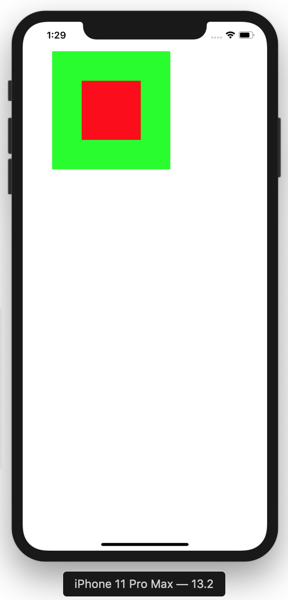

 
`Desarrollo Mobile` > `Swift Intermedio` 
	
## Implementando Child View Controllers

### OBJETIVO 

- Identificar como funcionan los métodos de clase de ViewController como ViewControllers Anidados.

#### REQUISITOS 

1. Xcode 11
2. Clase de UIView creada en el Ejemplo-03

#### DESARROLLO

Teniendo la Subclase de UIView…

1. Implementar un Child View Controller como se vio en los slides.

2. Los View Controllers deberán tener a su vez el ciclo de vida implementado con funciones `print()`.

3. Crear un nuevo proyecto en Xcode, esta vez agregar dos ViewControllers.

4. Cada ViewController agregar las funciones de ciclo de vida apoyados de un `print(#function)` y de un `print(nombreViewController`.

En el ViewController principal agregar estos dos VC de una manera similar a esta.

