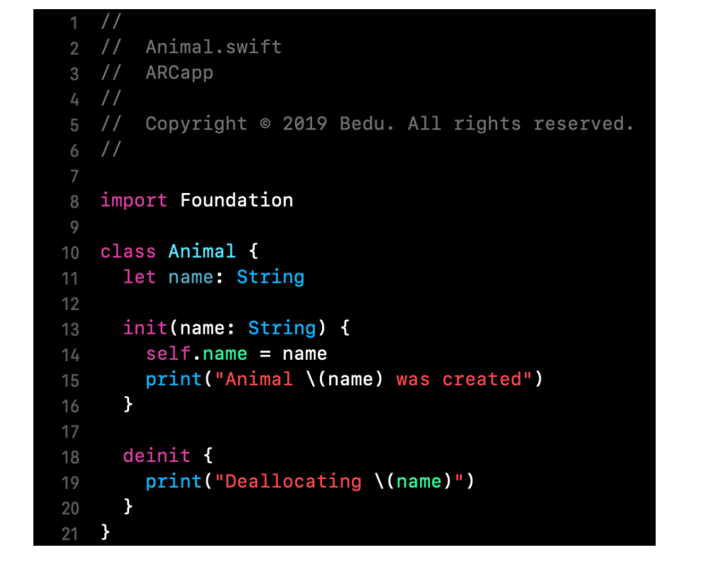
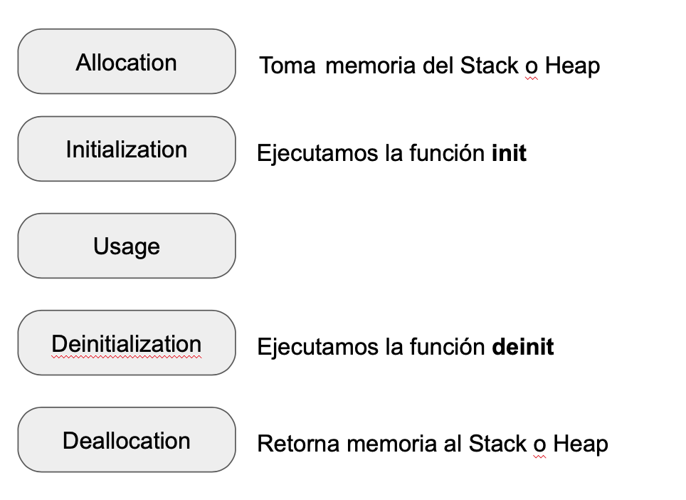
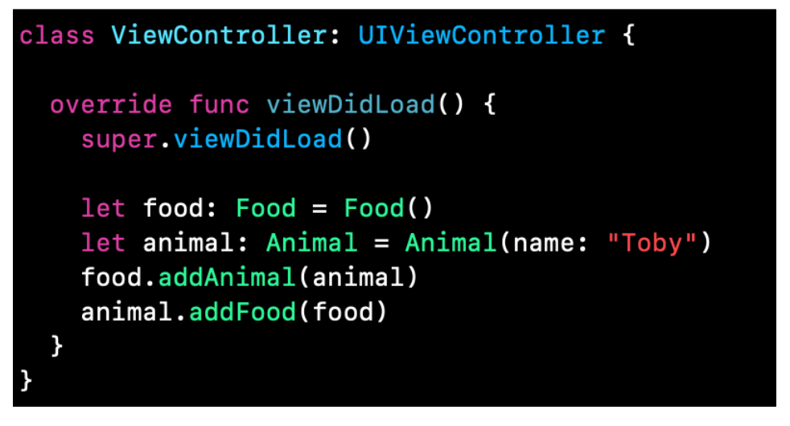

`Desarrollo Mobile` > `Swift Intermedio` 

## Provocando Memory Leaks

### OBJETIVO

- Entender que es un Memory Leak y que lo provoca.

#### REQUISITOS

1. Xcode 11

#### DESARROLLO

1.- Antes de comenzar, crearemos una clase de Swift.

Esta clase imprimirá si es inicializada o eliminada de memoria.

2.- Abrimos el ViewController.

Dentro de viewDidload() escribimos una instancia de esta clase.

Al ejecutar la App veremos en la consola los mensajes de init y deinit.

**Ciclo de vida de un Objeto**

En Swift al crear una instancia de un objeto, ejecutamos el constructor `init(...)`.

Cuando ya no necesitamos más dicho objeto, Swift se encarga de eliminarlo, entonces ejecutamos el destructor `deinit { }`.

Un ciclo de vida de un OBJETO en Swift consiste en los siguientes estados.

**Reference Counts**

También conocidos como usage counts, determina cuando un objeto no se necesita más.

Es decir, esta cuenta indica cuántas referencias hay hacia el objeto.

El objeto no será necesario cuando esa cuenta llegue a cero, por lo tanto, cuando nadie está utilizando este objeto, se ejecuta el **deinit{ }** y por último deallocation.

**Reference Cycles**

Supongamos que tenemos dos objetos, y cada uno de ellos se tiene como referencia.

Esto provoca un strong reference cycle. Y ninguno de los dos objetos puede liberarse deallocate.

Esto puede provocar Memory Leaks.

**Memory Leaks**

Un memory leak es una porción de memoria que es ocupada y no se vuelve a utilizar.

Un memory Leak aparece cuando un Objeto vive indefinidamente debido a un Retain Cycle. 

**Desarrollo**

3.- Crearemos un Memory Leak a propósito. La idea de este ejemplo es ver como están las referencias asociadas.

En el ViewController haremos una doble referencia...

#### Resultado

