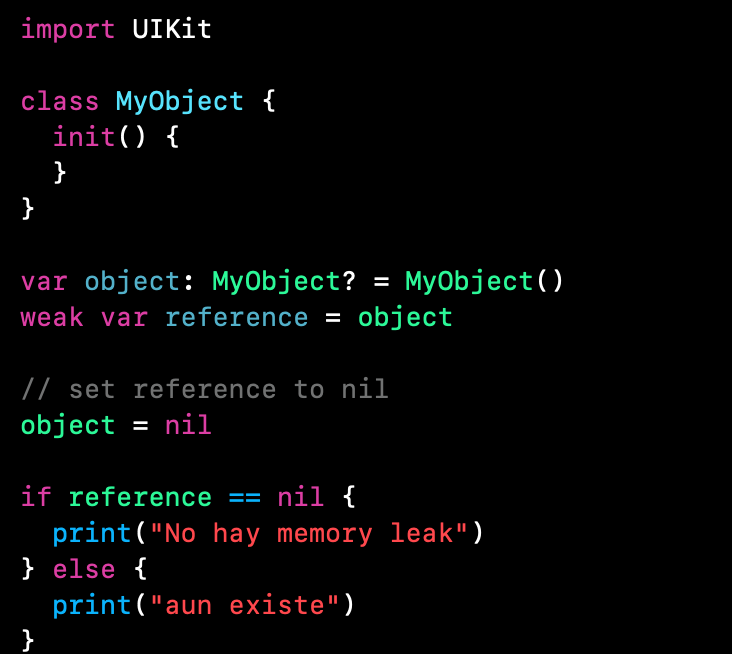

`Desarrollo Mobile` > `Swift Intermedio` 

## Implementación de Referencias Weak

### OBJETIVO

- Aprender a romper Retain Cycle

#### REQUISITOS

1. Xcode 11
2. Entendimiento de creación de Clases.

#### DESARROLLO

1.- Crear un Playground nuevo y crear una clase simple.

2.- Crear una instancia de dicha clase, luego implementar una variable de tipo `weak` asignandole el objeto creado.

3.- Asignaremos la referencia como `nil`.

4.- Verificamos mediante un IF-ELSE si el primer objeto creado aun existe o no.

