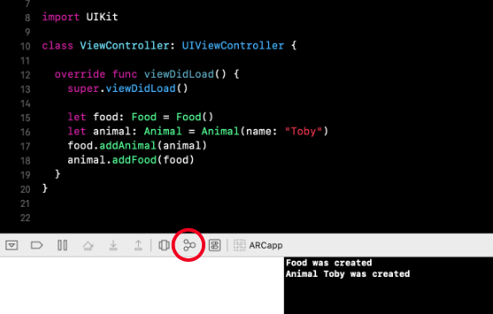
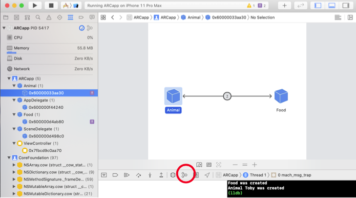
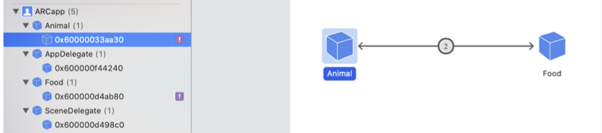
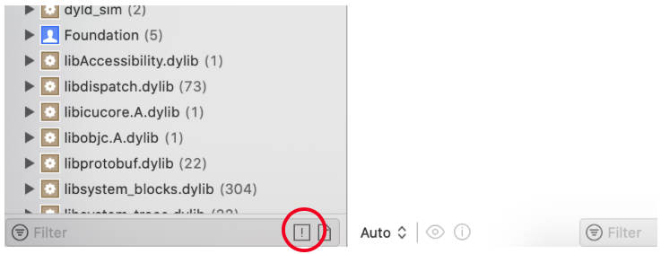
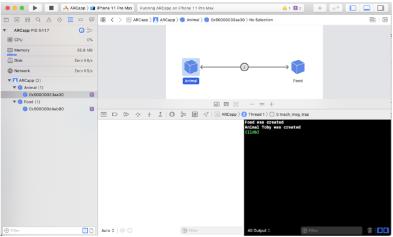
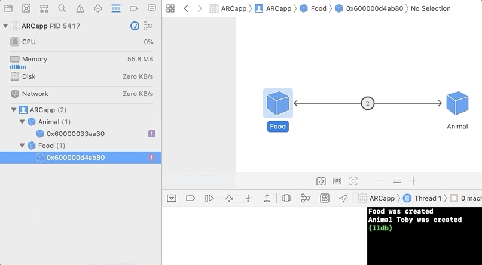
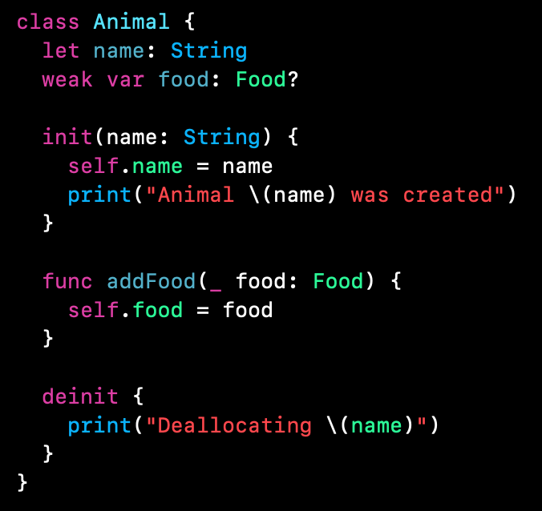

`Desarrollo Mobile` > `Swift Intermedio` 

## Debuggeando Retain Cycles

### OBJETIVO

- Aprender a utilizar las herramientas de Xcode para encontrar Memory Leaks o Retain Cycles.

#### REQUISITOS

1. Xcode 11.
2. Ejemplo-01 funcionando.

#### DESARROLLO

1.- Con base al código del Ejemplo-01, ejecutaremos la app y nos aseguraremos de que las funciones *deinit{ }* no son invocadas.

2.- Ubicamos el botón en Xcode de Debug Memory Graph.

3.- Este botón nos permitirá ver nuestras referencias en un modo gráfico.

4.- Al seleccionar un elemento vemos como esta conectado con otra referencia y también muestra el conteo de referencias de ARC.

5.- Vemos que aparecen muchos elementos en el Navigation, filtremos todos ellos, solo mostraremos los Leaks Blocks.

6.- El navigator se reduce bastante, solo nos muestra los LEAK BLOCKS que tenemos.

7.- Vemos que los dos LEAKS que tenemos están relacionados con los mismos objetos.

8.- Resolvemos el problema convirtiendo las variables en **weak**.

