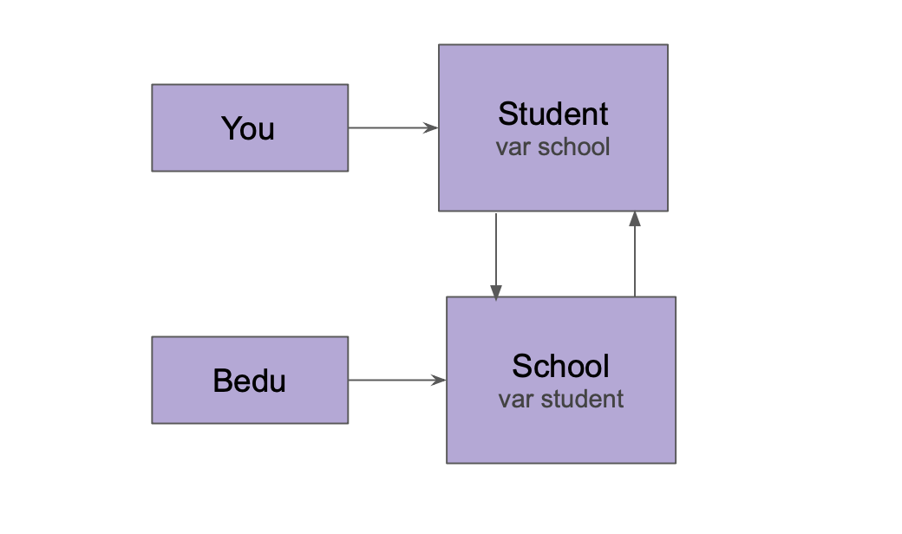

 
`Desarrollo Mobile` > `Swift Intermedio` 

## Implementacion de Reto-02 con Structs

### OBJETIVO 

- Aprender a detectar Retain Cycles con las herramientas de Xcode y como corregirlo.

#### REQUISITOS 

1. Xcode 11

#### DESARROLLO

1.- De acuerdo al diagrama crear las estructuras correspondientes y evitar un Retain Cycle.

        
Solución

La respuesta es no es posible.

