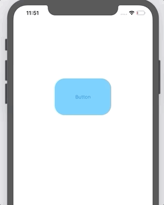
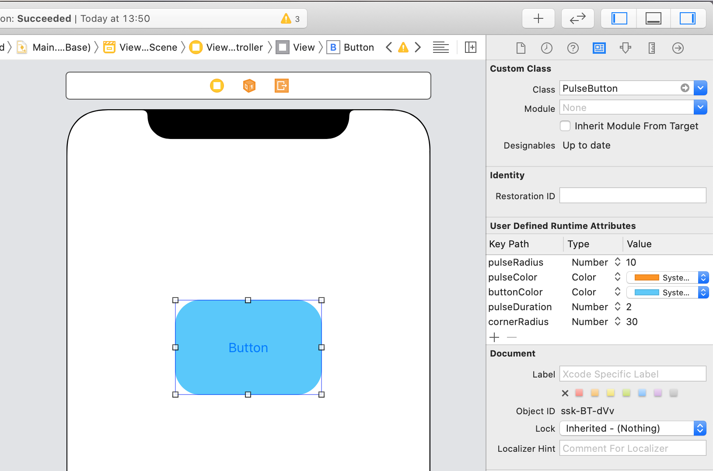

`Desarrollo Mobile` > `Swift Intermedio` 

## Implementando custom clases en Storyboard

### OBJETIVO

- Implementar clases en Objective-C directamente en el Storyboard.

#### REQUISITOS

1. Xcode 11.
2. [Clases](classes) proporcionadas para realizar el ejemplo.

#### DESARROLLO

Esta vez el ejemplo sube un poco de complejidad, pero es muy similar al Reto anterior.

1. Implementaremos dos clases de Objective-C en un UIButton, pero… en el **Storyboard** configuraremos la Clase a la que pertenece el botón y sus propiedades.

2. Una vez agregadas las clases de Objective-C al proyecto.

3. Ir al Storyboard y agregar un UIButton. 

4. Este UIButton deberá ser de la clase correspondiente a la clase de Objective-C.

5. Configuramos los parámetros correspondientes.

