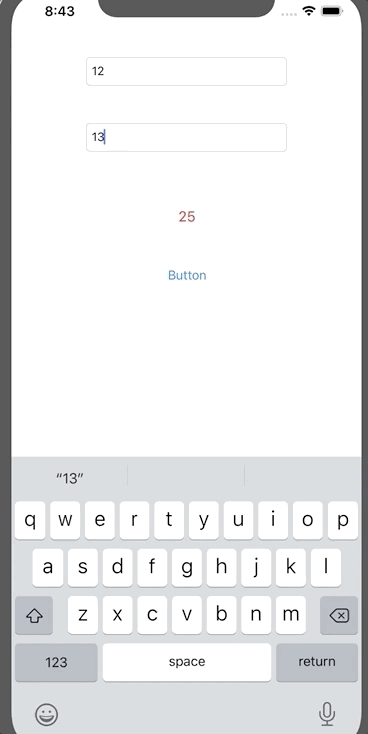

`Desarrollo Mobile` > `Swift Intermedio`

## Implementación con estructuras de control y elementos de UIKit.

### OBJETIVO 

- Familiarizarse mas con la sintaxis de Objective-C, esta vez utilizando estructuras de control y campos de texto.

#### REQUISITOS 

1. Xcode 11 

#### DESARROLLO

1.- Crear un proyecto nuevo basado en Objective-C como lenguaje.

2.- Agregar dos **UITextFields**, un **UILabel** y un **UIButton**.

3.- Se debe mostrar en un UILabel la suma de sus valores enteros.

Además, si los inputs son iguales pintar el texto en verde, si son diferentes en rojo.

<details>
	<summary>Solución</summary>
	<p> Al agregar los IBOulets en el ViewController.m implementamos el código para sumar y cambiar el color. </p>

```
  int value1 = _textField1.text.intValue;
  int value2 = _textField2.text.intValue;
  int result = value1 + value2;
  _label.text = [[NSString alloc] initWithFormat: @"%d", result];
  
  if (value1 == value2) {
    _label.textColor = [UIColor greenColor];
  } else {
    _label.textColor = [UIColor redColor];
  }
```
</details> 


