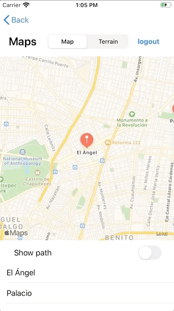

 
 
`Desarrollo Mobile` > `Swift Intermedio`
	
## Integrando clases mas complejas

### OBJETIVO 

- Aprender a implementar clases mas complejas en Objective-C en proyectos basados en Swift.

#### REQUISITOS 

0. Xcode 11
1. Archivos de template, utilizar la [Libreria](library).
2. Agregar la imagen proporcionada.
3. Utilizar el [Proyecto de App](appcode).

#### DESARROLLO

1.- Con base en el Proyeco de App proporcionado, la libreria y la imágen.

2.- Agregar los archivos de la libreria y la imagen al proyecto de Xcode.

3.- Crear un Bridge.

4.- Reemplazar el código de Logout por una implementación de la clase de la libreria.

<details>
	<summary>Solución</summary>
	<p> Una vez realizado los pasos 1 al 3, nos dirigimos al MainViewController. En la función de logout implementamos:</p>

```
	 let alert: VSAlertController = VSAlertController(title: "title",
                                                     message: "message",
                                                     image: UIImage(named: "bedu"),
                                                     preferredStyle: .alert)!
    let action: VSAlertAction = VSAlertAction(title: "Close",
                                              style: .cancel,
                                              action: nil)!
    alert.add(action)
    self.present(alert, animated: true, completion: nil)
```
</details> 




