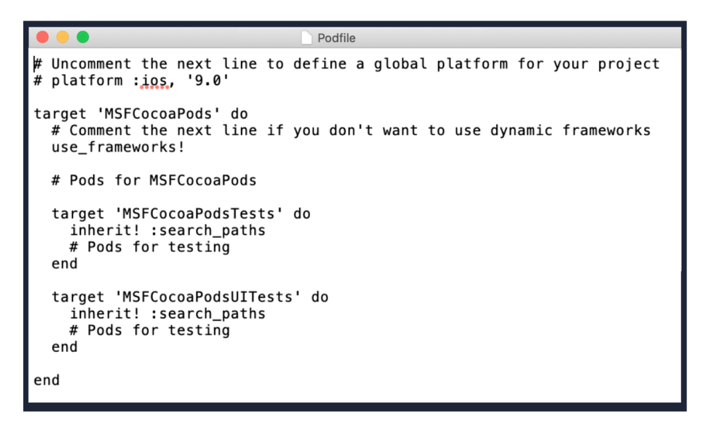

`Desarrollo Mobile` > `Swift Intermedio`

## Cocoapods, primeros pasos

### OBJETIVO

- Aprender a Integrar una Libreria de CocoaPods en un Proyecto de iOS

#### REQUISITOS

0. Conexión a Internet
1. Contraseña de administrador del sistema.
2. Terminal de macOS 
3. Xcode 11

#### DESARROLLO

Integrando una librería de CocoaPods a un proyecto de iOS.

1.- Crearemos un nuevo proyecto en Xcode, basándonos en Storyboards y Swift.

2.- Con la terminal nos dirigimos a la carpeta de nuestro proyecto.

3.- Ya estando en la carpeta, ingresamos el comando:

> $ pod init

Esto creará un nuevo archivo, el archivo Podfile.

4.- Tendremos un archivo Podfile parecido a esto:

Especificamos versión de iOS, target o nombre del proyecto y los nombres de los Pods a utilizar.

5.- Vamos a instalar un Pod llamado Lottie. Escribimos en el Podfile.

> pod 'lottie-ios'

6.- Instalamos, nos vamos a la terminal y tecleamos...

> pod install

