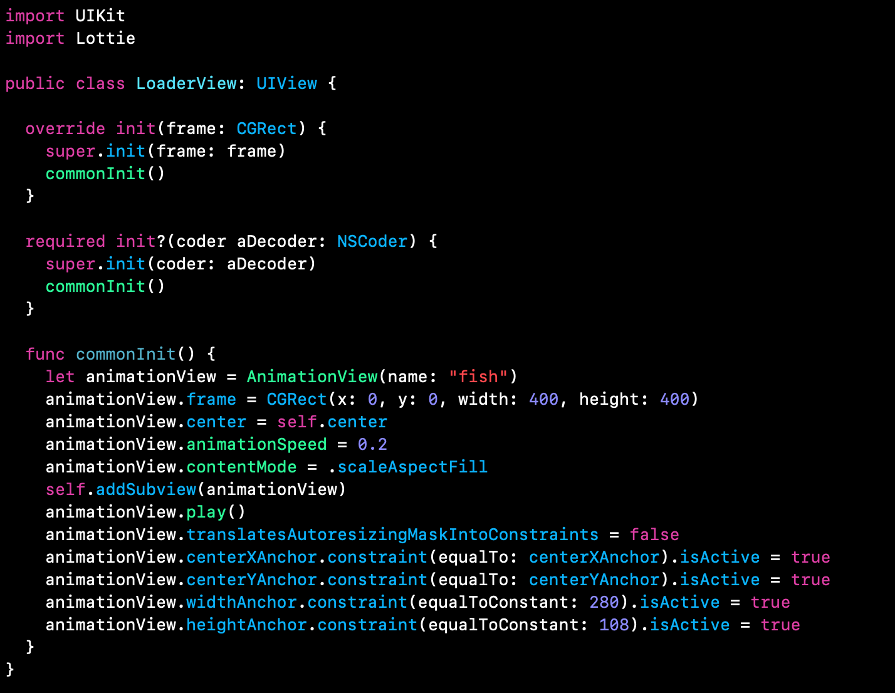

`Desarrollo Mobile` > `Swift Intermedio`

## Utilizando el Pod para agregar funcionalidad

### OBJETIVO

- Una vez integrado un **Pod**, el alumno deberá ser capaz de utilizar el código para agregar funcionalidad extra a su proytecto.

#### REQUISITOS

0. Conexión a Internet
1. Contraseña de administrador del sistema.
2. Terminal de macOS 
3. Xcode 11

#### DESARROLLO

1.- Ya tenemos el JSON y el pod instalado, procedemos a crear una función que permita agregar la animación en un UIView.

2.- Creamos una nueva clase de Swift en el proyecto y comenzamos a escribir...

**NOTA**: *"fish"* es el nombre del *JSON* de la animación. Manejar nombres en minúsculas sin caracteres especiales ni números.

3.- Para agregar la animación nos apoyaremos de una clase con función estática.

4.- En donde gustes colocar la animación, agregar un Subview con fondo transparente.
Este subview deberá heredar de la clase LoaderView.

#### Resultados

