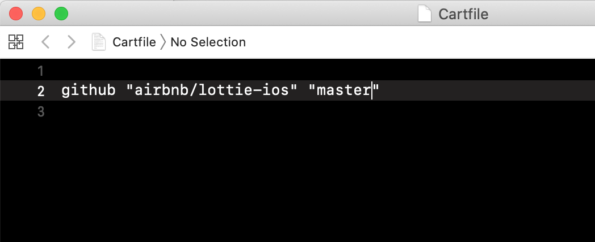
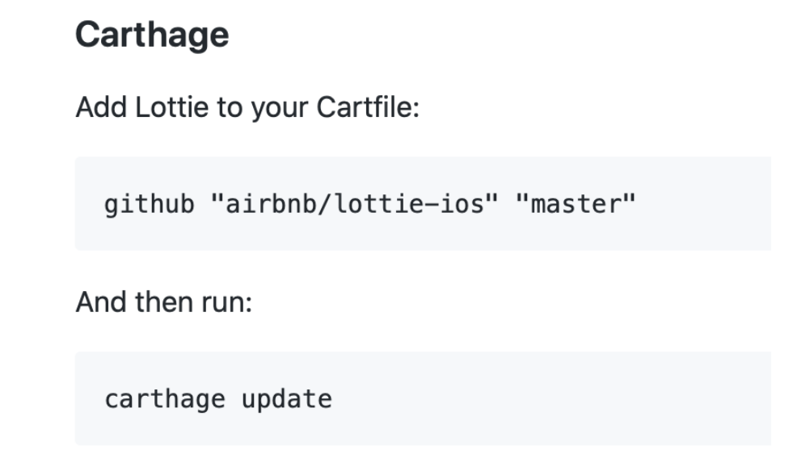
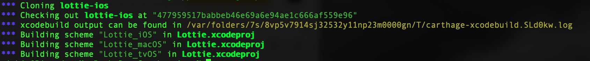
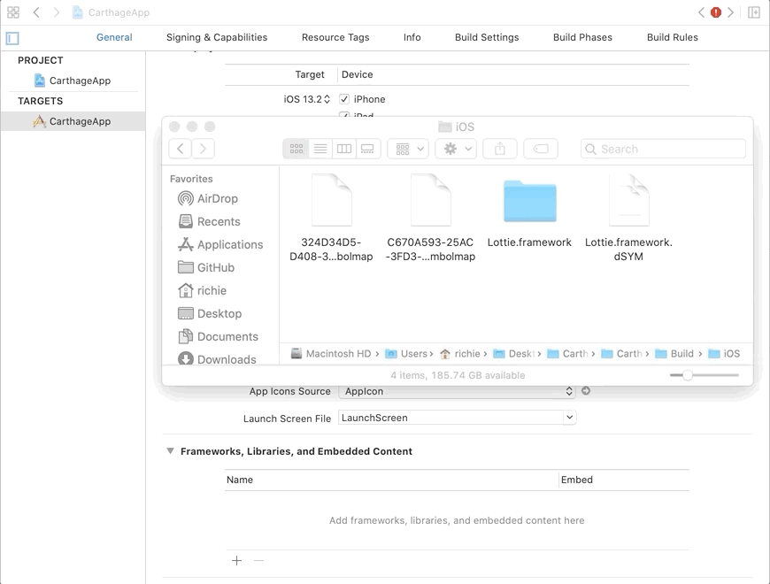

 
Desarrollo Mobile` > `Swift Intermedio` 

## App con animación

### OBJETIVO

0. Conexión a Internet
1. Contraseña de administrador del sistema.
2. Terminal de macOS 
3. Xcode 11

#### REQUISITOS

1. Crear una App donde se muestre una animación.

#### DESARROLLO

Vamos a crear una App donde se muestre una animación. Integrando una librería de Carthage a un proyecto de iOS.

1.- Crearemos un nuevo proyecto en Xcode, basándonos en Storyboards y Swift.

2.- Con la terminal nos dirigimos a la carpeta de nuestro proyecto.

Instalaremos Lottie pero con Carthage. Desde la terminal de macOS. 
 
3.- Vamos a la carpeta de nuestro proyecto.

4.- Ingresamos este comando para crear un Cartfile.

> touch Cartfile

5.- Abrimos el archivo. Agregamos el repositorio a usar.

> open -a Xcode Cartfile

Agregaremos la animación en json al proyecto.

6.- Compilamos con Carthage.

7.- Una vez finalizado, agregaremos el framework en nuestros Linked Libraries.

Debe estar en un Path parecido a este:

> .../CarthageApp/Carthage/Build/iOS

8.- Desarrollaremos la App agregando las [clases](clases).

