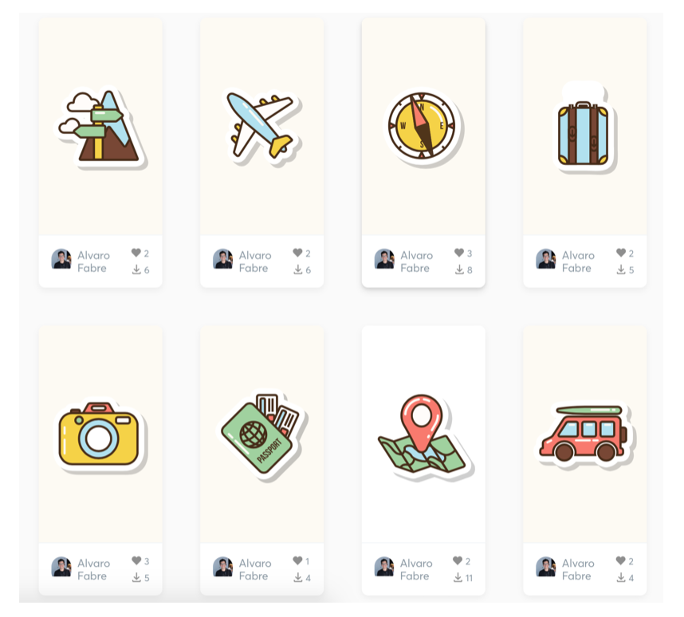

 
Desarrollo Mobile` > `Swift Intermedio` 
	
## Animaciones y Pods

### OBJETIVO 

- Adaptar clases para hacerlas más genéricas.
- Instalar Pods
- Aprender a utilizar Lottie.

#### REQUISITOS 

0. Conexión a Internet
1. Contraseña de administrador del sistema.
2. Terminal de macOS 
3. Xcode 11

#### DESARROLLO

1.- Agregar más animaciones a tu proyecto.

2.- Elige las que te gusten, pero deben estar implementadas en vistas distintas de la app.

3.- Descarga los archivos en [LottieFiles](https://lottiefiles.com/recent?page=6).



4.- Quizás tengas que modificar la clase **LoaderView**.

<details>
	<summary>Solución</summary>
	<p> Así como se agregó un UIView en la vista de Login, agregar uno en la vista de tu preferencia, puede ser en el **MainViewController**.</p>
	<p> Esta vista debe heredar de LoaderView.</p>
	<p> Dentro del ViewController implementar el código asignandole el nombre del JSON, y una función que permita ejecutar la animación.</p>

```
  @IBOutlet weak var animationView: LoaderView!
  
  override func viewDidLoad() {
    super.viewDidLoad()
    // TableView
    animationView.name = "plane"
    animationView.play()
    animationView.clipsToBounds = true
    // more code here...
    }
```
<p> La clase de **LoaderView** se modificaria: </p> 

```
import UIKit
import Lottie

public class LoaderView: UIView {
  
  var name: String?
  
  override init(frame: CGRect) {
    super.init(frame: frame)
  }
  
  required init?(coder aDecoder: NSCoder) {
    super.init(coder: aDecoder)
  }
  
  func play() {
    guard let name = name else { return }
    let animationView = AnimationView(name: name)
    animationView.frame = CGRect(x: 0, y: 0, width: self.frame.width, height: self.frame.height)
    animationView.center = self.center
    animationView.animationSpeed = 0.2
    animationView.contentMode = .scaleAspectFill
    self.addSubview(animationView)
    animationView.play()
    animationView.translatesAutoresizingMaskIntoConstraints = false
    animationView.centerXAnchor.constraint(equalTo: centerXAnchor).isActive = true
    animationView.centerYAnchor.constraint(equalTo: centerYAnchor).isActive = true
    animationView.widthAnchor.constraint(equalToConstant: self.frame.width).isActive = true
    animationView.heightAnchor.constraint(equalToConstant: self.frame.height).isActive = true
  }
}
```

</details> 

