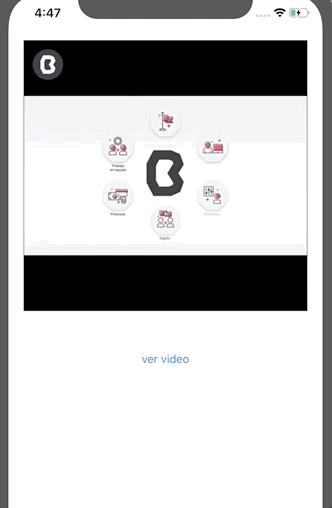

 
Desarrollo Mobile` > `Swift Intermedio` 

## YouTube App

### OBJETIVO

Con base a la documentación del Readme de algún repositorio, crear una app utilizando Cocoapods.

#### REQUISITOS

0. Conexión a Internet
1. Contraseña de administrador del sistema.
2. Terminal de macOS 
3. Xcode 11

#### DESARROLLO

Esta vez crearemos un proyecto nuevo, donde implementaremos la instalación de este Pod.

El reto consiste en leer la documentación del Pod.

Con base a la documentación, instalar el **Pod** en un proyecto de iOS.

El Pod es para reproducir videos de YouTube.

> https://github.com/youtube/youtube-ios-player-helper

Implementar un **UIView** que herede de la clase del *Pod* (investigar que clase es).

Una vez implementada la clase, agregar un **Key** para reproducir video.

Ejemplo:

> https://www.youtube.com/watch?time_continue=2&v=velPquCnw7k

El Key sería: `velPquCnw7k`.

        
Solución

        
 Instalar el Podfile en el proyecto de Xcode.

        
 Una vez agregado el Podfile, ir al Storyboard.

        
 En el Storyboard, agregar un UIView y en el Inspector agregar la Clase. La clase es: YTPlayerView

         
 Un botón enviará el video a reproducir.

